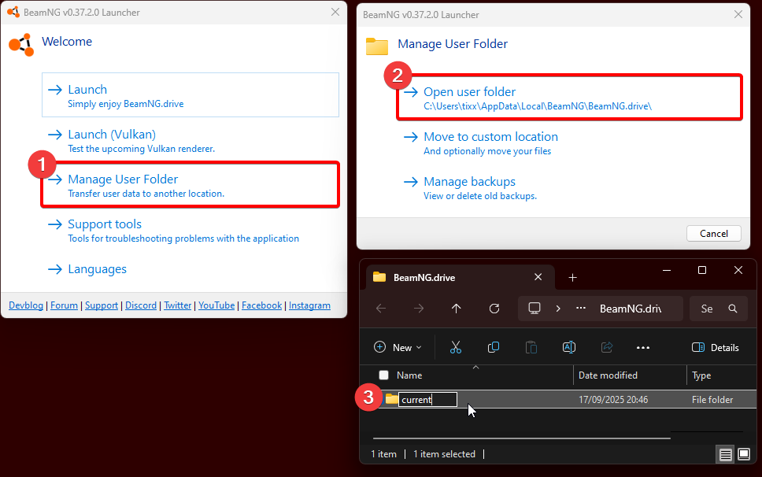

## Warum muss ich meine Mods deaktivieren?

In BeamMP stellt der Server, mit dem du dich verbindest, die notwendigen Mods bereit. Diese werden beim Verbinden automatisch heruntergeladen und aktiviert. Sind lokale Mods installiert und aktiviert, funktioniert BeamMP oft nicht richtig, selbst wenn du nur einen zusätzlichen Mod neben BeamMP hast.

!!! warning

    Entferne alle Mods, die du im Ordner BeamNG.Drive\content\ oder in Unterordnern abgelegt hast. Dieser Speicherort ist NICHT für die Installation von Mods vorgesehen und kann zu Problemen führen, wie in der Datei `DO_NOT_INSTALL_MODS_HERE.txt` im selben Verzeichnis beschrieben.

    !!! quote "DO_NOT_INSTALL_MODS_HERE.txt"

        Kopiere KEINE Mods in diesen Ordner: Dies kann zu beschädigten Mods, einer langsameren Installation von Updates, einem beschädigten Mod-Manager, einem beschädigten abgesicherten Modus und anderen Problemen führen.

## Wie deaktiviere/entferne ich meine Mods?

Es gibt drei Möglichkeiten, mögliche Probleme bei der Verwendung von BeamMP zu lösen.

### 1. Mods deaktivieren

Bevor du einem Server beitrittst, stelle sicher, dass du außer „multiplayerbeammp“ keine Mods aktiviert hast. Wenn das Spiel einfriert oder weiterhin Probleme auftreten, probiere den nächsten Schritt.

### 2. Erstellen eines neuen Benutzerordners

Öffne den Benutzerordner von BeamNG.Drive und benenne den Ordner der neuesten Version (z. B. 0.35) um, z. B. in 0.xx_OLD (0.35_OLD). Schließe BeamNG.drive, bevor du ihn umbenennst. 

### 3. Entfernen von Mods aus dem content Ordnern.

Um auf den Ordner Beamng.drive\content\ zuzugreifen und ihn von allen Mods zu bereinigen, öffne den Installationsort von BeamNG.drive. Klicke mit der rechten Maustaste auf den Ordner `content` und lösche ihn. Überprüfe anschließend die Spieldateien über Steam oder Epic Games. Dadurch werden die Dateien erneut heruntergeladen.

Starte anschließend BeamNG.Drive über den BeamMP-Launcher. Im Repository sollte „multiplayerbeammp“ als einziger aktivierter Mod verfügbar sein. Im Hauptmenü findest du außerdem die Schaltfläche zum Aufrufen von BeamMP. Solltest du weiterhin Probleme beim Beitritt zu gemoddeten Servern haben, liegen wahrscheinlich defekte/veraltete Mods vor.

### 4. BeamMP-Launcher Cache bereinigen

Um zwischengespeicherte Mods aus den BeamMP-Verzeichnissen zu entfernen, gehe zum Installationsort deines BeamMP-Launchers. Standardmäßig lautet der Pfad „C:\Benutzer\AppData\BeamMP-Launcher“. Dort findest du den Ordner „Ressourcen“. Lösche diesen Ordner, um alle zwischengespeicherten Mods zu löschen. Dies kann hilfreich sein, wenn du mehr Speicherplatz auf deiner Festplatte benötigst oder veraltete BeamNG-Mods entfernen möchtest.

!!! question "Meine Einstellungen und Konfigurationen sind weg! Wie kann ich sie wiederherstellen?"

    Wenn du den Benutzerordner umbenannt hast, wurde das Spiel gezwungen, einen neuen, sauberen Benutzerordner zu erstellen. Du kannst die beiden Ordner „Einstellungen“ und „Fahrzeuge“ aus dem umbenannten Ordner (z. B. 0.34_OLD) in den neu erstellten Ordner kopieren.
    Stelle sicher, dass BeamNG.Drive geschlossen ist, und ersetze alle Elemente am Zielort. Alle Konfigurationen und Einstellungen sollten nun wiederhergestellt sein.
