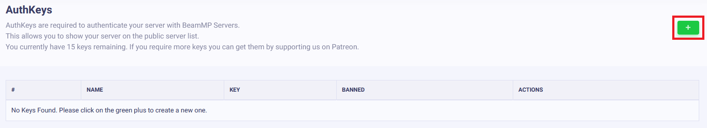

# Server Installation

## **Einen Server erstellen**

Die Grundlagen für das Erstellen eines Servers

---

### **Übersicht**

**Von Zuhause aus einen Server anzubieten ist kostenlos. Einen externen VPS zu verwenden ist jedoch meist leichter und wesentlich sicherer!**

Server sind ein integraler Teil von BeamMP. Spieler verbinden sich darüber. Diese laufen nativ auf Windows und Linux.

Du kannst einen privaten Server erstellen, welcher nur zugänglich für vertraute Personen ist, oder einen öffentlichen Server, der in der Serverliste aufscheint.

Einen Server einzurichten ist ein Prozess von ein paar Schritten! Wenn du Probleme hast, Frage im [Forum](https://forum.beammp.com) oder auf unserem [Discord server](https://discord.gg/beammp) im `#support` Kanal. Siehe auch [Server Wartung](server-maintenance.md) für mehr Informationen.

Lies dir die [LICENSE](https://raw.githubusercontent.com/BeamMP/BeamMP-Server/master/LICENSE) des Servers vorher durch!

Achtung: Der Server unterstützt nur IPv4 . Wenn du dir nicht sicher bist, welche du hast, schau auf  [*whatsmyip.org*](https://www.whatsmyip.org/) nach. *&nbsp;Wenn die Adresse * `_:_` *&nbsp;Doppelpunkte enthält, ist dies eine  **IPv6** Adresse. In diesem Fall solltest du überprüfen, ob du auch eine IPv4 Adresse hast. Du kannst hierzu deinen Anbieter anrufen oder jemanden im Haushalt fragen (Wenn sich jemand auskennt, wird es die Person bestimmt wissen). IPv6 support ist in Planung.*

## Den Server aufsetzen

Das Aufsetzten besteht aus ein paar Schritten. Du solltest unbedingt alle befolgen.

### 1. Port Weiterleitung

*Wenn du auf einem VPS (Virtual Private Server) oder Rootserver bist, kannst du den folgenden Schritt überspringen. Wenn du nicht weißt was ein VPS oder Rootserver ist, bist du warscheinlich auch auf keinem.*

Dieser Schritt ist wichtig, wenn jemand außerhalb des Heim-Netzwerks deinem Server beitreten möchte.

#### ACHTUNG:

Durch die Portweiterleitung bist du dir der Risiken bewusst, die mit der  Öffnung von Ports in dein Heimnetzwerk verbunden sind. Daher erlischt das Recht, BeamMP für etwaige (schwerwiegende) Schäden haftbar zu machen, die dir oder Ihrem Haushalt entstehen können.

Daher wird empfohlen, einen Server bei einem unserer Partnerdienste zu hosten!

Kostenpflichtige Server:

- [Horizon Hosting](https://hrzn.link/beammp)
- [Racing Game Servers](https://racinggameservers.com/games/beamng-drive/)
- [Snakecraft Hosting](https://schost.us/beammp-plans)
- [Connect Hosting](https://connecthosting.net/beammp)
- [Assetto Hosting](https://assettohosting.com/en/games/beamng)
- [WinHeberg](https://winheberg.fr/offres/gaming/beammp?lang=en)
- [Street Inc](https://billing.streetinc.org/)
- [Zap Hosting](https://zap-hosting.com/en/beammp-server-hosting/)
- [HostHavoc](https://hosthavoc.com/)
- [PedalHost](https://pedal.host/)

**Alle anderen Unternehmen, die BeamMP-Server-Hosting anbieten und hier nicht aufgeführt sind, sind nicht seriös und berechnen dir möglicherweise mehr als unsere Partner**

*HINWEIS: Wenn du einen Server über einen unserer Partner hostest, ist der Schritt zur Portweiterleitung nicht erforderlich.*

Nun zurück zu Port Forwarding. Dieser Schritt ist derselbe wie für fast alle anderen Spielserver wie Minecraft Server. Du kannst gute Tutorials online finden, sogar Anleitungen für dein spezifisches Routermodell. Eine gute Anleitung wäre [dieses tutorial](https://www.noip.com/support/knowledgebase/general-port-forwarding-guide/). Stelle sicher, dass du den Port **30814** für **TCP** and **UDP** weiterleitest.

Der **Standard-Port** für BeamMP ist **30814**, wenn nötig kann jedoch auch ein anderer Port statt 30814 gewählt werden, sollte aber nicht unterhalb von 1024 sein. Der Port muss sowohl auf **TCP** wie auch auf **UDP** weitergeleitet werden. Es ist zu empfehlen den Port bei 30814 zu belassen, da es hier am unwahrscheinlichsten ist, dass ein anderer Service diesen Port verwendet. ACHTUNG: Wenn du mehrere Server auf einem Computer hostest, benötigt jeder Server einen eigenen Port. Beispiel: Server 1: 30814, Server 2: 30815.

#### 1.1 Firewall

Abhängig von deinem Setup, muss in der Firewall eine Ausnahme für den BeamMP-Server erstellt werden. Dies ist der Fall bei Windows (das ausschalten der Firewall funktioniert meistens **nicht**) und auf vielen vorinstallierten Linux Servern.

Sowohl Ein- als auch Ausgehende Verbindungen auf **TCP** und **UDP** müssen als Firewall-Regel für die Anwendung BeamMP-Server.exe freigegeben werden. Wenn deine Firewall stattdessen nach einem Port fragt, muss dies derselbe Port sein, den du in Schritt „1. Portweiterleitung“ verwendet hast (Standard ist 30814).

Wenn du Probleme hast, frag auf unserem [Forum](https://forum.beammp.com) oder dem[Discord Server](https://discord.gg/beammp) im `#support` Kanal.

### 2. Authentifizierungsschlüssel

Der Authentifizierungsschlüssel, auch “Authentication Key” oder “AuthKey” genannt, ist nötig, um einen Öffentlichen Server zu erstellen. Für einen privaten Server benötigst du nicht zwingend einen offiziellen Schlüssel, jedoch darf das Feld in der Konfigurationsdatei nicht leer gelassen werden.

Um einen Schlüssel zu erwerben ist ein [Discord](https://discord.com) Konto erforderlich. Das ist wichtig um gegen Spam zu schützen.

#### 2.1. Die Schlüssel-Übersicht öffnen

Melde dich mit Discord beim [Keymaster](https://beammp.com/keymaster) an. Klicke auf der Keymaster-Homepage links auf dem Bildschirm auf „Keys“:


<figure markdown="">    </figure>

#### 2.2. Einen Schlüssel erstellen

Um einen Schlüssel zu erstellen, klicke oben rechts auf die grüne Schaltfläche „+“.


<figure markdown="">    </figure>

#### 2.3. Schlüssel-Informationen eingeben

Fülle das Feld „Servername“ aus (dies dient nur zur Information für dich, damit zu einem späteren Zeitpunkt ein Schlüssel einem Server zugeordnet werden kann) und klicke dann auf „Erstellen“. Beispiel:


<figure class="image image_resized" style="width:44.84%;" markdown="">    </figure>

es sollte am Ende wie folgt aussehen:


<figure markdown="">    </figure>

**GEBE DIESEN SCHLÜSSEL NIEMALS AN ANDERE WEITER UND ZEIGEN IHN AUCH NIEMANDEM. BEHANDLE IHN WIE EIN PASSWORT.**

Du hast die Möglichkeit, zwei kostenlose Schlüssel zu erstellen. Ein Schlüssel kann jeweils nur auf einem aktiven Server gleichzeitig verwendet werden. Du kannst also nicht zwei Server gleichzeitig mit demselben Schlüssel betreiben.

#### 2.4. Den Schlüssel kopieren

Kopiere den Text im “Key” Feld. In diesem Beispiel wäre das  `3173a2e-6az0-4542-a3p0-ddqq5ff95558`. Klicke das ,,Klemmbrett Symbol" neben dem Schlüssel um diesen zu kopieren.


<figure markdown="">    </figure>

### 3. Installation

Es gibt Server-Anwendungen für Windows und Linux. Die folgenden zwei Abschnitte widmen sich Windows und Linux separat.

#### 3.a. Installation auf Windows

Für die Linux Installation, springe zum nächsten Punkt.

Sei sicher, dass du die nötigen Ports weitergeleitet hast. Ansonsten kann niemand außerhalb des Netzwerks dem Server beitreten!

1. Stelle sicher dass das [Visual C++ Redistributables](https://aka.ms/vs/17/release/vc_redist.x64.exe) Paket installiert ist.
2. Downloade die EXE von [beammp.com](https://www.beammp.com/).<br>Diese sollte dann so aussehen:<br>`BeamMP-Server.exe`.
3. Nach dem runterladen, erstelle einen Ordner indem du die `BeamMP-Server.exe` ablegst. Dort wird der Server  betrieben.
4. Mittels Doppelklick startet man den Server. Beim ersten Start erstellt der Server automatisch die benötigten Dateien, im anschluss schliesst sich das Serverfenster von selbst. Nun solltes du die `ServerConfig.toml` neben dem `BeamMP-Server.exe` sehen.
5. (optional) Für schnellen Zugriff kannst du eine Desktop Verknüpfung zu `BeamMP-Server.exe` erstellen mittels **[Rechtsklick]** &gt; **Senden zu** &gt; **Desktop (erstelle Verknüpfung).**

Nun springe zu Schritt "4. Konfiguration".

#### 3.b. Installation auf Linux

##### Vorgefertigte Binaries verwenden

Dieser Schritt funktioniert auf allen Distributionen für die wir Binaries anbieten. Binaries findest du [hier](https://github.com/BeamMP/BeamMP-Server/releases/latest). Wenn du auf einer anderen Distribution bist, schau dir "Binary selbst erstellen” im Schritt darunter an.

1. Stelle sicher, dass du die nötigen Abhängigkeiten installiert hast. Eine Liste findest du [hier](https://github.com/BeamMP/BeamMP-Server#runtime-dependencies).
2. Gehe zu [beammp.com](https://beammp.com/) und klicke “Download Server”. Du wirst im Anschluss auf die GitHub Seite weitergeleitet.
3. Downloade die richtige Version für deine Distribution und CPU-Architektur. Zur Erleichterung nennen wir diese `BeamMP-Server-xxx`. Ansonsten denotiert `xxx` die Version deiner Distro.
4. Nach dem Download solltest du neben anderen Dateien eine Datei namens `BeamMP-Server-xxx` sehen, die du vorerst ignorieren kannst. Erstelle irgendwo einen Ordner und lege die `BeamMP-Server-xxx` dort ab. Dort wird der Server betrieben.
5. Öffne ein Terminal, navigiere zu dem Ordner in dem der `BeamMP-Server-xxx` liegt und führe `chmod +x BeamMP-Server-xxx` aus. Das stellt sicher, dass du die korrekte Berechtigungen hast.
6. Start den Server mittels `./BeamMP-Server-xxx`. Der Server erstellt automatisch die benötigten Dateien. <br>Wenn Text im Server Feld erscheint, kannst du diesen wieder schließen. Du solltest eine `ServerConfig.toml` neben dem `BeamMP-Server.exe` sehen.
7. (optional) Es wird empfohlen einen User namens `beammpserver` (oder ähnlich) zu erstellen, da wir empfehlen, NICHT den Server als root, sudo oder mit dem persönlichen Useraccount auszuführen. Du solltest dann die nötigen Schritte tätigen um den Server als den Server-user zu starten.

Nun springe zu Schritt "4. Konfiguration".

##### Binary selbst erstellen

Andere Distributionen zusätzlich zu denen, für die es [hier](https://github.com/BeamMP/BeamMP-Server/releases/latest) bereits eine Server-Binary gibt, funktionieren wahrscheinlich auch, werden aber nicht offiziell unterstützt. Wenn du diese selbst erstellen möchten, kannst du das tun, indem du die Quelle auf unserem [GitHub](https://github.com/BeamMP/BeamMP-Server) herunterlädst. Ein Tutorial findest du [hier](https://github.com/BeamMP/BeamMP-Server#build-instructions) .

Führe zum Abschluss den Server unbedingt einmal mit `./BeamMP-Server` aus und fahre dann mit dem nächsten Schritt fort.

### 4. Konfiguration

Nachdem der Server einmal gestartet wurde, sollte er die nötigen Dateien erstellt haben und einen oder zwei Fehler in die Konsole schreiben. Das ist normal, da wir noch nicht fertig sind.<br>Es sollten nun folgende Dateien vorhanden sein:


<figure markdown="">    </figure>

Diese werden oft “ServerConfig”, “Server” und “BeamMP-Server” (keine Erweiterungen wie “.exe”) genannt. Diese sind aber auch korrekt!

Öffne die `ServerConfig.toml` mit einem Texteditor wie zum Beispiel `Notepad` . Dies kannst du mit <strong>[Rechtsklick] → „Öffnen mit…“</strong> und anschließender Auswahl eines Texteditors tun.

Die Datei sollte ungefähr so aussehen

```TOML
[General]
AuthKey = ''
Debug = false
Description = 'BeamMP Default Description'
Map = '/levels/gridmap_v2/info.json'
MaxCars = 1
MaxPlayers = 10
Name = 'BeamMP Server'
Port = 30814
Private = false
ResourceFolder = 'Resources'
```

Das ist die Konfigurationsdatei des Servers. Sie verwendet das TOML Format. Siehe [Server Maintenance](server-maintenance.md) Sektion für mehr Informationen.

Als erstes kümmern wir uns um den <code>AuthKey</code>. Dazu muss der Schlüssel zwischen die Anführungszeichen <code>" "</code> eingefügt werden.

Für unser Beispiel sollte der Eintrag so aussehen:

```TOML
AuthKey = '3173a2e-6az0-4542-a3p0-ddqq5ff95558'
```

Gib deinem Server im Feld `Name` einen Namen. Man kann diesen mit Farben und mehr formatieren. Weitere Informationen findest du in [diesem Abschnitt zur Namensanpassung](server-maintenance.md#customize-the-look-of-your-server-name) auf der Serverwartungsseite.

Wenn du einen anderen **Port** als **30814** ausgewählt hast, achte darauf, ihn hier unter `Port` zu ersetzen.

**WICHTIG:** Der Server wird **NICHT** in der Serverliste angezeigt, solange `Private = true` ist. *Wenn* du möchtest, dass er in der Liste angezeigt wird, setze dies auf **`Private = false`**.

### 5. Validierung

Nun führe den Server nochmal aus und prüfe, ob er weitere `[ERROR]` Zeilen ausspuckt. Das Konsolenfenster muss offen bleiben. Ab diesem Punkt kannst du BeamMP mit dem BeamMP-Launcher starten und solltest den Server inder Liste mit dem vergebenen Namen in der `ServerConfig.toml` sehen.

---

#### 5.1 Wie man dem Server Mods hinzufügt

Fahrzeug und Map Mods werden unterschiedlich im Server installiert, müssen aber beide im Ordner  (`Resources/Client`) abelegt werden. Alle Mods die hinzugefügt werden sollen kommen in diesen Ordner.

#### 5.2 Allgemeine Mods

Wenn du nur modifizierte Fahrzeuge hinzufügen möchtest, lege die Zip-Datei der Mods einfach in den Ordner `Resources/Client`. Diese werden automatisch von jedem heruntergeladen, der dem Server beitritt.

#### 5.3 Karten

Alle Standardkarten (Karten, die keine Mods sind) funktionieren sofort und müssen nicht installiert werden. Du änderst einfach die `Map` in der `ServerConfig.toml` Datei auf eine der [folgenden](server-maintenance.md#all-vanilla-maps-names) . Für alle anderen modifizierten Karten gehen Sie wie folgt vor:

1. Legen die `.zip` Datei der Karte in den Ordner <br> `Resources/Client` des Servers.
2. Sieh dir als Nächstes in die Zip-Datei der Karte (entpacke sie nicht) und öffne den Ordner „ `levels` “. In diesem Ordner sollte sich lediglich ein weiterer Ordner mit dem Namen der Karte befinden, zum Beispiel „myawesomedriftmap2021“. Achte darauf, diesen Namen *genau so zu kopieren oder zu merken, wie er im Namen dieses Ordners geschrieben ist.*
3. Öffne die `ServerConfig.toml`. In der `Map` Einstellung solltest du  `/levels/MAPNAME/info.json` sehen, wobei `MAPNAME` wahrscheinlich so etwas wie `gridmap_v2` ist. Ersetze diesen `MAPNAME` nun durch den Namen des Ordners aus dem letzten Schritt. In diesem Beispiel war es `myawesomedriftmap2021` . Am Ende sollte es so aussehen (für dieses Beispiel) und am Ende <code>/info.json</code> <em><strong>haben</strong></em> .

```TOML
Map = '/levels/myawesomedriftmap2021/info.json'
```

Wenn jemand deinem Server beitritt, sollte die Karte automatisch heruntergeladen werden und wie erwartet funktionieren.

**Wenn dies NICHT funktioniert** , installiere die Karte in Ihrem Einzelspieler-BeamNG.drive, starte es und rufe die Karte auf. Öffne dann die Konsole, indem du die Taste `~` ( *Tilde* ) drückst (wenn du eine nicht-US-Tastatur verwendest, sieh dir die Aktion **Systemkonsole umschalten** im Menü **Optionen &gt; Steuerung &gt; Bindungen** im Abschnitt **Allgemeines Debuggen an** ) und führe `print(getMissionFilename())` aus. Dies sollte dir dann den zu verwendenden Namen anzeigen.

Das wärs! Die modifizierte Karte sollte jetzt geladen werden!

### 6. Dem eigenen Server beitreten

Wie du und andere Personen deinem Server beitreten können.

#### 6.a. Dem eigenen Server beitreten

Du solltest dich per Direktverbindung mit dem Server verbinden, auch wenn dieser öffentlich ist. Klicke dazu links neben der Serverliste auf die **Registerkarte „Direktverbindung“** . Lasse die Standardinformationen dort (sollte 127.0.0.1 und Port 30814 sein) und klicke dann auf „Verbinden“. Wenn der Server außerhalb des Hauses gehostet wird, musst du [die IP auf diesem Computer finden](https://whatismyipaddress.com/) und auf diese Weise eine Direktverbindung herstellen.

#### 6.b. Andere Personen, die die privaten Server beitreten

Starte den Server. Du  musst den Personen die IP-Adresse deines Servers geben. Sei jedoch vorsichtig, mit wem du deine öffentliche IP-Adresse deines Zuhauses weitergibst! Um dem privaten Server beizutreten, müssen die Spieler in BeamMP zur **Registerkarte „Direktverbindung“** gehen und dann deine IP und den Port eingeben.

#### 6.c. Andere Personen, die deinem öffentlichen Server beitreten

Um deinem öffentlichen Server beizutreten, kannst du einfach zur Serverliste gehen, den Namen des Servers eingeben und auf „Verbinden“ klicken. Wenn du dir nicht sicher bist, wie der Servername lautet, ist es der Name, welcher in der  `ServerConfig.toml` hinterlegt ist. Stelle sicher, dass Suchfilter deaktiviert sind und die Karte auf „Beliebig“ eingestellt ist, wenn der Server nicht auftaucht. Man kann die IP-Adresse des Servers auch auf der [Keymaster-](https://beammp.com/keymaster) Website überprüfen.

Solltest du oder deine Freunde die Fehlermeldung „Verbindung fehlgeschlagen!“ erhalten, suche im BeamMP Fenster nach Codes wie 10060, 10061, 10030. Dies bedeutet, dass dein Router entweder eine CGNAT IPv4 oder IPv6 hat, oder bei Schritt **1 Portweiterleitung** oder **1.1 Firewall etwas falsch gemacht wurde.** Um zu prüfen, ob du eine CGNAT IPv4 hast, suche die WAN-IP-Adresse auf der Schnittstelle des Routers. Vergleiche diese mit Ihrer öffentlichen IP, die auf [*whatsmyip.org*](https://www.whatsmyip.org/) aufgeführt ist. IPv6-Unterstützung ist noch **NICHT** implementiert.

#### 6.d. **[FUNKTIONIERT MÖGLICHERWEISE NICHT]** Für private Server (Hamachi):

Damit jemand deinem Server beitreten kann, muss er sich in deinem Hamachi-Netzwerk befinden. Du musst hierfür keine Portweiterleitung durchführen. Nach dem Beitritt zu deinem Hamachi-Netzwerk verwendet der Benutzer die Hamachi-IP und den Standardport, um eine direkte Verbindung zu dem Server herzustellen. Weitere Informationen findest du in diesemr [Hamachi-](https://forum.beammp.com/t/tutorial-how-to-host-a-server-with-logmein-hamachi/52) Anleitung.

## Immer noch Probleme?

Öffne ein Post auf dem [Forum](https://forum.beammp.com) oder auf dem [Discord server](https://discord.gg/beammp) im `#support` Kanal.
