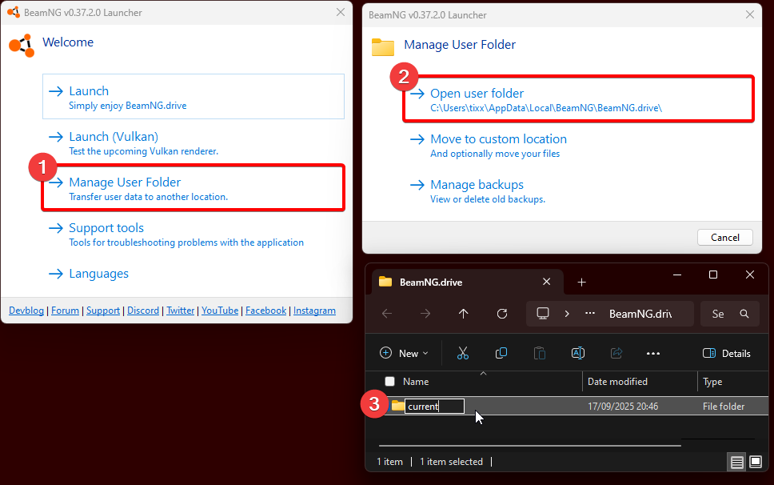

## Why do I have to deactivate/remove my mods?

In BeamMP, the Server you decide to connect to, provides the necessary mods. These get downloaded and activated automatically upon connecting.
Having local mods installed and active often leads to BeamMP not functioning properly, even if you have just one additional mod besides BeamMP.

There are 3 options to resolve possible issues caused by mods with using BeamMP.

### 1. Deactivate mods 
Before joining any server, make sure you have no mods besides 'multiplayerbeammp' enabled.
If this method does not work, for example the game freezes / shows a blackscreen, or you still have issues, refer to the next option.

### 2. Creating a new Userfolder
Open the BeamNG.Drive userfolder and rename the `current` folder to for example `current_old`. Close BeamNG.drive before renaming the folder.
The result should be a clean new userfolder.

??? question "My settings and configs are gone! How can I restore them?"

    If you have renamed the userfolder, you forced the game to create a new, clean userfolder. You may copy the 'settings' and 'vehicles' folder from the folder you renamed (e.g. `current_old`) to the new folder it created.
    Make sure BeamNG.Drive is closed and replace all elements in the location you want to copy the folders to. You should now have all configs and settings as they were before.

    !!! warning "Be careful when moving back files/folders to the new userfolder.
           
        If you resolved any issues by renaming the userfolder, moving back the old files may cause any issues you had to possibly re-occur.

After you are done, start BeamNG.Drive via the BeamMP-Launcher and you should have 'multiplayerbeammp' as your only enabled mod available in the repository as well as the button on the Main Menu to enter BeamMP.
If you still have issues joining modded server, they likely provide broken/outdated mods.

### 3. Cleaning up the BeamMP-Launcher cache.
To clean up cached mods from the BeamMP directories, go to the installation location of your BeamMP-Launcher. By default, the path would be 'C:\Users\AppData\BeamMP-Launcher\'. In there, you will find a 'Resources' folder.
Delete the folder to delete all cached mods. This can be helpful if you need more space on your disk or want to clean out oudated BeamNG mods.

### 4. Removing mods from the content folders.
If you have placed mods in the content folder, you should remove them.
To access the Beamng.drive\content\ folder and clean the folder of any mods, open the installation location of BeamNG.drive.
Right click the `content` folder and delete it. Proceed to verify the game files via Steam or Epic Games. This is going to download the base files again.

    ??? quote "DO_NOT_INSTALL_MODS_HERE.txt"
    
        Do NOT copy mods into this folder: it can lead to broken mods, slower installation of updates, a broken mod manager, broken Safe Mode and others.
