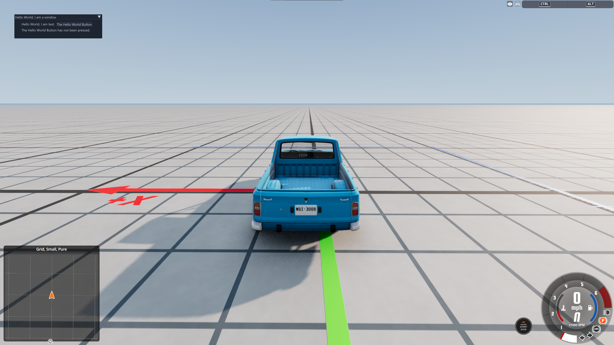

# Creating an ImGui Window

This page covers how to create a basic ImGui window.

## Setup

Before using ImGui, some setup is required:

```lua
local im = ui_imgui -- shortcut to prevent lookups all the time. should help with optimization
local imguiExampleWindowOpen = im.BoolPtr(true)
```

`imguiExampleWindowOpen` will be used to determine when this example window should be rendered.

## Window Rendering

ImGui windows and their contents must be recreated for every frame they should be displayed. This means that some form of onUpdate function is necessary to use ImGui.

```lua
local function onUpdate()
	if worldReadyState == 2 then
		if imguiExampleWindowOpen[0] == true then
			imguiExample()
		end
	end
end
M.onUpdate = onUpdate
```

This will run a function to create this example's window, so long as the level is fully loaded, and that the example window should be displaying.

## Window Content

If you're new to writing ImGui, think of it as a distant cousin of HTML:

* `im.SetNextWindowSize(im.ImVec2(x, y), im.Cond_FirstUseEver)` defines your viewport size if it hasn't already been defined
* `im.Begin()` and `im.End()` is your `<body>` and `</body>`
* `im.Text()` is your `<p></p>`

```lua
local buttonPresses = 0

local function imguiExample()
	im.SetNextWindowSize(im.ImVec2(366, 100), im.Cond_FirstUseEver) -- prepare our window
	im.Begin("Hello World, I am a window") -- create a window with the title of "Hello World, I am a window"
		im.Indent() -- a... padding element
			im.Text("Hello World, I am text.") -- add a line of text, somewhat like a <p> element
			im.SameLine() -- Not really HTML. This appends the following element to the same line as the previous element.
			if im.Button("The Hello World Button") then -- Like <button>. This runs Lua when pressed.
				buttonPresses = buttonPresses + 1
			end
			if buttonPresses > 0 then
				im.Text("The Hello World Button has been pressed " .. buttonPresses .. " times!")
			else
				im.Text("The Hello World Button has not been pressed.")
			end
		im.Unindent() -- end the "padding element"
	im.End() -- complete our "canvas" so it can be drawn
end
```

You can add the following function to easily toggle visibility of the window:

```lua
local function toggleExampleImgui()
	imguiExampleWindowOpen[0] = not imguiExampleWindowOpen[0]
end
```

## Result

<figure class="image image_resized" style="width:100%" markdown>
  
</figure>

When the The Hello World Button button is pressed, the counter below it will update to display the amount of times the The Hello World Button button has been pressed.

## Download

This tutorial is almost entirely based off of [StanleyDudek](https://github.com/StanleyDudek)'s ImGui example mod. You can download this example mod [here](../../../../assets/content/imguiExample.zip).
