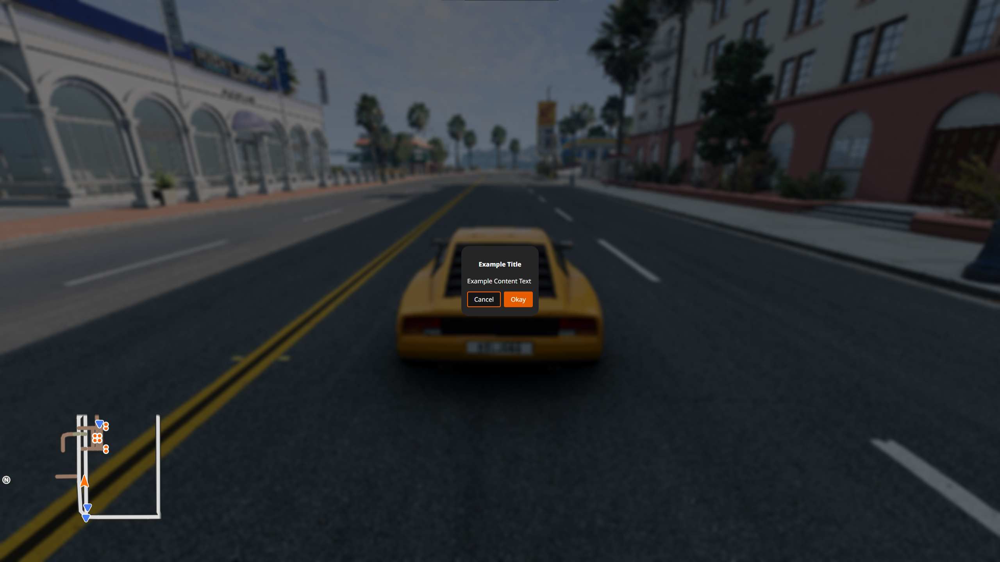
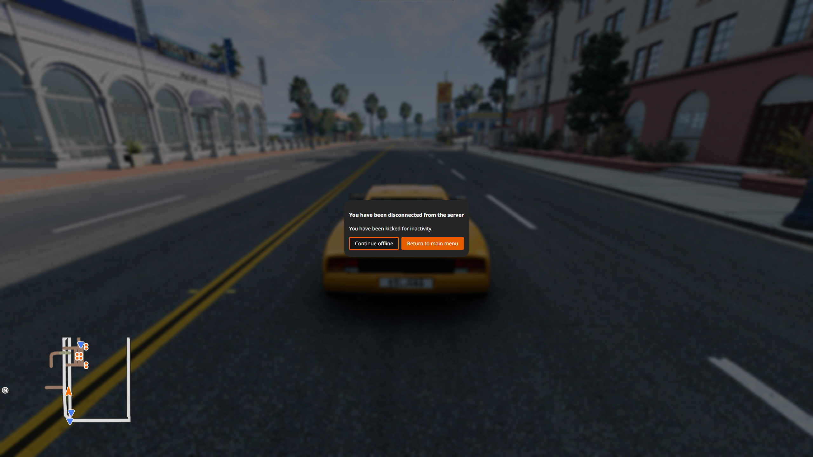

!!! warning "This site is under construction!"

    This site is being actively worked on. 
    
    Feel you could help? Please do by clicking on the page with a pencil on the right!

    This can be done any page too.
    
# BeamNG.drive Lua Code Snippets

## World

### Drawing a marker & Vehicle detection

Drawing markers in the map can be one of the best ways to indicate to the user that there is some form of interaction that they can do there.

Drawing a marker is fairly easy. Here is an example of how the bus route marker is drawn:

```lua
  local function createBusMarker(markerName)
    local marker =  createObject('TSStatic')
    marker:setField('shapeName', 0, "art/shapes/interface/position_marker.dae")
    marker:setPosition(vec3(0, 0, 0))
    marker.scale = vec3(1, 1, 1)
    marker:setField('rotation', 0, '1 0 0 0')
    marker.useInstanceRenderData = true
    marker:setField('instanceColor', 0, '1 1 1 0')
    marker:setField('collisionType', 0, "Collision Mesh")
    marker:setField('decalType', 0, "Collision Mesh")
    marker:setField('playAmbient', 0, "1")
    marker:setField('allowPlayerStep', 0, "1")
    marker:setField('canSave', 0, "0")
    marker:setField('canSaveDynamicFields', 0, "1")
    marker:setField('renderNormals', 0, "0")
    marker:setField('meshCulling', 0, "0")
    marker:setField('originSort', 0, "0")
    marker:setField('forceDetail', 0, "-1")
    marker.canSave = false
    marker:registerObject(markerName)
    scenetree.MissionGroup:addObject(marker)
    return marker
  end

  -- this can then be called in a loop to setup your markers. 
  -- NOTE: You should only do this once as part of your setup and not called on each frame.
  if #markers == 0 then
    for k,v in pairs(nameMarkers) do
      local mk = scenetree.findObject(v)
      if mk == nil then
        log('I', logTag,'Creating marker '..tostring(v))
        mk = createBusMarker(v)
        ScenarioObjectsGroup:addObject(mk.obj)
      end
      table.insert(markers, mk)
    end
  end
```

Here is a custom marker example from [BeamNG-FuelStations](https://github.com/BeamMP/BeamNG-FuelStations/tree/master):

```lua
  local stations = [
    { "location": [ -778.813,  485.973, 23.46 ], "type":"gas" },
    { "location": [  617.164, -192.107, 53.2  ], "type":"ev"  },
  ]

  local function IsEntityInsideArea(pos1, pos2, radius)
    return pos1:distance(pos2) < radius
  end

  local onUpdate = function (dt)
    for k, spot in pairs(stations) do -- loop through all spots on the current map
      local bottomPos = vec3(spot.location[1], spot.location[2], spot.location[3])
      local topPos = bottomPos + vec3(0,0,2) -- offset vec to get top position (2m tall)

      local spotInRange = false -- is this spot in range? used for color
      local spotCompatible = false -- is this spot compatible?

      if activeVeh then -- we have a car and its ours (if in mp)
        local vehPos = activeVeh:getPosition()

        spotInRange = IsEntityInsideArea(vec3(vehPos.x, vehPos.y,vehPos.z), bottomPos, 1.5)

        spotCompatible = activeFuelType == "any" or spot.type == "any" or activeFuelType == spot.type
      end

      local spotColor = (spotInRange and spotCompatible) and activeColorMap[spot.type] or inactiveColorMap[spot.type] or ColorF(1,1,1,0.5)

      debugDrawer:drawCylinder(bottomPos:toPoint3F(), topPos:toPoint3F(), 1, spotColor) --bottom, top, radius, color
    end
  end
```

## User Interface

### Toast Notifications, Top right of screen

<figure class="image image_resized" style="width:75%" markdown>
  
</figure>

```lua
--guihooks.trigger('toastrMsg', {type, title, msg, config = {timeOut}}) 
guihooks.trigger('toastrMsg', {type = "info", title = "Info Message:", msg = "Info Message Text Here", config = {timeOut = 5000}}) 
guihooks.trigger('toastrMsg', {type = "warning", title = "Warning Message:", msg = "Warning Message Text Here", config = {timeOut = 5000}}) 
guihooks.trigger('toastrMsg', {type = "error", title = "Error Message:", msg = "Error Message Text Here", config = {timeOut = 5000}}) 
```

### Message notifications, top left of screen by default in Messages app

This requires the 'Messages' or 'Messages & Tasks' UI app. Icons can be found at `ui\ui-vue\src\assets\fonts\bngIcons\svg\`

<figure class="image image_resized" style="width:75%" markdown>
  
</figure>

```lua
--guihooks.trigger('Message', {msg, ttl, category, icon})
--ui_message(msg, ttl, category, icon)
guihooks.trigger('Message', {msg = "Message Text Here", ttl = 5.0, category = "arrow_upward", icon = "arrow_upward"}) 
guihooks.trigger('Message', {msg = "Message Text Here", ttl = 5.0, category = "arrow_downward", icon = "arrow_downward"}) 
guihooks.trigger('Message', {msg = "Message Text Here", ttl = 5.0, category = "flag", icon = "flag"}) 
guihooks.trigger('Message', {msg = "Message Text Here", ttl = 5.0, category = "check", icon = "check"}) 
guihooks.trigger('Message', {msg = "Message Text Here", ttl = 5.0, category = "check_circle", icon = "check_circle"}) 
guihooks.trigger('Message', {msg = "Message Text Here", ttl = 5.0, category = "warning", icon = "warning"}) 
guihooks.trigger('Message', {msg = "Message Text Here", ttl = 5.0, category = "error", icon = "error"}) 
guihooks.trigger('Message', {msg = "Message Text Here", ttl = 5.0, category = "directions_car", icon = "directions_car"}) 
guihooks.trigger('Message', {msg = "Message Text Here", ttl = 5.0, category = "star", icon = "star"}) 
guihooks.trigger('Message', {msg = "Message Text Here", ttl = 5.0, category = "timeline", icon = "timeline"}) 
guihooks.trigger('Message', {msg = "Message Text Here", ttl = 5.0, category = "save", icon = "save"}) 
guihooks.trigger('Message', {msg = "Message Text Here", ttl = 5.0, category = "settings", icon = "settings"}) 
```

### Center large or small display flash

<figure class="image image_resized" style="width:75%" markdown>
  
</figure>

<figure class="image image_resized" style="width:75%" markdown>
  
</figure>

```lua
--guihooks.trigger('ScenarioFlashMessage', {{msg, ttl, sound, big}} ) -- requires RaceCountdown ui app
guihooks.trigger('ScenarioFlashMessage', {{"Message", 5.0, 0, true}} ) 
guihooks.trigger('ScenarioFlashMessage', {{"Message Text Here", 5.0, 0, false}} ) 

--countdown example, when all executed at once, the items are queued and will follow eachother after the previous ttl expires
guihooks.trigger('ScenarioFlashMessage', {{"3", 1.0, "Engine.Audio.playOnce('AudioGui', 'event:UI_Countdown1')", true}}) 
guihooks.trigger('ScenarioFlashMessage', {{"2", 1.0, "Engine.Audio.playOnce('AudioGui', 'event:UI_Countdown2')", true}}) 
guihooks.trigger('ScenarioFlashMessage', {{"1", 1.0, "Engine.Audio.playOnce('AudioGui', 'event:UI_Countdown3')", true}}) 
guihooks.trigger('ScenarioFlashMessage', {{"GO!", 3.0, "Engine.Audio.playOnce('AudioGui', 'event:UI_CountdownGo')", true}}) 

--another sound example
guihooks.trigger('ScenarioFlashMessage', {{"Teleported!", 3.0, "Engine.Audio.playOnce('AudioGui', 'event:UI_Checkpoint')", false}}) 
```

### Center mid-size persistent display

This requires the 'Race Realtime Display' UI app.

<figure class="image image_resized" style="width:75%" markdown>
  
</figure>

```lua
--guihooks.trigger('ScenarioRealtimeDisplay', {msg = msg} ) -- requires Race Realtime Display ui app
guihooks.trigger('ScenarioRealtimeDisplay', {msg = "Message Text Here"} )
--these messages persist, clear with a blank string
--if you are running live data, this is a good one to update rapidly (think timers, distance calcs, et cetera)
guihooks.trigger('ScenarioRealtimeDisplay', {msg = ""} )
```

### Confirmation Dialog

ConfirmationDialog is a simplistic popup with up to two buttons.

```lua
-- Open a ConfirmationDialog with a title, body text, and up to two buttons
guihooks.trigger("ConfirmationDialogOpen",
    "Example Title",
    "Example Body Text",
    "Okay",
    "", --gelua. empty string
    "Cancel",
    "" --gelua
)

-- Close any open ConfirmationDialog with the provided title
guihooks.trigger("ConfirmationDialogClose", "Example Title")
```

<figure class="image image_resized" style="width:75%" markdown>
  
</figure>

Both fields of a button must be strings in order for the button to appear.

If the Okay button is provided, pressing the *OK / Primary action* action is equivalent to pressing the Okay button.

If the Cancel button is provided, pressing the *Menu* action is equivalent to pressing the Cancel button.

HTML is supported and can be used to add images/icons, for example.

Multiple can be displayed at once, displayed sequentially.

!!! bug

    Providing no buttons prevents the player from escaping the dialog without using the console.

!!! bug

    The SDF parts of the Minimap UI app remain visible while a ConfirmationDialog is active.

    `#!lua guihooks.trigger('ShowApps', false)` to hide UI apps can be used as a hacky workaround.

<figure class="image image_resized" style="width:75%" markdown>
  
</figure>

### introPopupTutorial

introPopupTutorial is a highly customizable popup that is largely defined with embedded HTML. It is standard to load from a standalone HTML file located in `/gameplay/tutorials/pages/*/content.html`.

```lua
guihooks.trigger("introPopupTutorial", {
    {
        content = readFile("/gameplay/tutorials/pages/template/content.html"):gsub("\r\n",""),
        flavour = "onlyOk"
    }
})

guihooks.trigger("introPopupClose")
```

<figure class="image image_resized" style="width:75%" markdown>
  
</figure>

`flavour` controls which buttons are displayed. Four flavours exist:

* `withLogbook`
    * Buttons: Career Logbook, Okay
* `onlyOk`
    * Buttons: Okay
* `onlyLogbook`
    * Buttons: Career Logbook
* `noButtons`
    * Provides no buttons

!!! warning

    When using the noButtons flavour on the page, providing no extra JavaScript in the page content to close the popup causes a softlock. Pages are not combined into one popup in this flavour. It is not recommended to use this flavour.

If multiple pages are provided, or the hook is triggered multiple times, then the pages are combined into the same popup. If the hook is triggered while a introPopup is active, or when a different introPopup type has already been triggered, then it is displayed in a separate popup after the existing popup is closed.

### introPopupCareer

introPopupCareer is an easy to use, but open ended popup that supports embedding HTML, if needed.

Flavours control which buttons are displayed and the default image aspect ratio. Four flavours exist:

* `default`
  * Default image aspect ratio: 16x9
  * Buttons: Later, Okay
* `welcome`
  * Default image aspect ratio: 16x9
  * Buttons: Career Logbook, Okay
* `branch-info`
  * Default image aspect ratio: 16x9
  * Buttons: Career Logbook, Okay
* `garage`
  * Buttons: Later, Okay

```lua
guihooks.trigger("introPopupCareer", {
    {
        title   = "Example title",
        text    = "Example text",
        image   = "/gameplay/tutorials/pages/template/image.jpg",
        ratio   = "16x9",
        flavour = "default"
    }
})

guihooks.trigger("introPopupClose")
```

<figure class="image image_resized" style="width:75%" markdown>
  
</figure>

If multiple pages are provided, or the hook is triggered multiple times, then the pages are combined into the same popup. If the hook is triggered while a introPopup is active, or when a different introPopup type has already been triggered, then it is displayed in a separate popup after the existing popup is closed.

!!! bug

    The background blur has a minimum height, causing popups with short content to have excess blur below its window. Two main workarounds exist:

    * Repeat `\n` and end with `#!html <div />` until the window covers the blur
    * Use an empty or missing `image` path and adjust the aspect ratio until the window covers the blur

### introPopupMission

introPopupMission is almost identical to introPopupCareer, but needs buttons to be defined rather than picking a preset for buttons.

Button styles are combined as *bng-button-*`style`. Built-in button styles are:

* `main` - orange
* `secondary` - cyan
* `attention` - red
* `white` - white
* `link`  - translucent
* `outline` - orange outline

```lua
guihooks.trigger('introPopupMission', {
    title   = "introPopupMission title",
    text    = "introPopupMission description",
    image   = "/gameplay/tutorials/pages/template/image.jpg",
    ratio   = "16x9",
    buttons = {
        { default=true,  class="main",      label="main button",      clickLua="" },
        { default=false, class="secondary", label="secondary button", clickLua="" },
        { default=false, class="attention", label="attention button", clickLua="" },
        { default=false, class="white",     label="white button",     clickLua="" },
        { default=false, class="link",      label="link button",      clickLua="" },
        { default=false, class="outline",   label="outline button",   clickLua="" }
    }
})

guihooks.trigger("introPopupClose")
```

<figure class="image image_resized" style="width:75%" markdown>
  
</figure>

If multiple pages are provided, or the hook is triggered multiple times, then the pages are combined into the same popup. If the hook is triggered while a introPopup is active, or when a different introPopup type has already been triggered, then it is displayed in a separate popup after the existing popup is closed.

!!! bug

    The background blur has a minimum height, causing popups with short content to have excess blur below its window. Two main workarounds exist:

    * Repeat `\n` and end with `#!html <div />` until the window covers the blur
    * Use an empty or missing `image` path and adjust the aspect ratio until the window covers the blur

### Dialogue

Dialogue is used in the *A Rocky Start* campaign to display information about a mission. It is a centered, vertically aligned popup with a specific layout. It does not support embedding HTML.

```lua
ui_missionInfo.openDialogue({
    title    = "Dialogue title",
    type     = "Custom", -- isn't actually displayed
    typeName = "typeName",
    data     = {
        {label = "objective",  value = "reward"}
        -- add more...
    },
    buttons  = {
        {action = "accept", text = "Accept",  cmd = ""},
        {action = 'decline',text = "Decline", cmd = ""}
        -- add more...
    }
})

ui_missionInfo.closeDialogue()
```

<figure class="image image_resized" style="width:75%" markdown>
  
</figure>

Only one Dialogue can be displayed at once. Any existing Dialogue is overridden.

!!! info

    `#!lua ui_missionInfo.closeDialogue()` must be used to close a dialogue.

    Make sure you call this function when any button is pressed.
