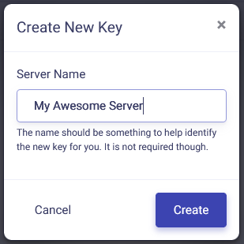

# Server Installation

## **Creating a Server**
Basics of setting up the server application

---
### **Overview**

**Making a server for BeamMP is simple and free!**

Servers are an integral part of BeamMP; players are connected to each other through the server. They run natively on Windows and Linux.

You can make private servers, which only people you invite can join, or public servers, which will show in our official server list.

Getting a server up and running is a process with a few steps! It's quite easy, but if you run into any issues, feel free to ask on our [Forum](https://forum.beammp.com) or on our [Discord server](https://discord.gg/beammp) in the `#support` channel. Also refer to the [Server Maintenance](server-maintenance.md) section for more info. 

Please make sure to read the [LICENSE](https://raw.githubusercontent.com/BeamMP/BeamMP-Server/master/LICENSE) of the server before use.

Note: _The server only supports IPv4\. If you don't know which one you have, look at the IP address you see on_ [_whatsmyip.org_](https://www.whatsmyip.org/) _- if it contains_ `_:_` _colons, it's **IPv6**. In that case, you should investigate further whether you also have an IPv4\. You can call your ISP to find this out, or ask someone who lives with you (if they're tech-savvy, they might know!). IPv6 support is planned._

## Setting up the Server

Setup consists of a few steps, you should follow all of them.

### 1. Port forwarding

_If you are on a VPS (Virtual Private Server) or Rootserver, you can usually skip this step. If you're unsure about what a VPS or Rootserver is, you aren't on one._

This step is necessary if you want someone outside of your household to join ("outside of your local network").

This step is the same for almost every game's server, such as Minecraft Servers, so you can find many tutorials online for this, even for your specific router model. A good full guide is [this tutorial](https://www.noip.com/support/knowledgebase/general-port-forwarding-guide/). Make sure you forward port  **30814**, as **TCP** and **UDP**. 

While the default **Port** you want to “forward” is **30814**, you can choose any other number >1024, but you need to note down what you picked if it's not 30814\. You need to forward both **TCP** and **UDP**. 

If you have issues, also feel free to ask on our [Forum](https://forum.beammp.com) or on our [Discord server](https://discord.gg/beammp) in the `#support` channel.

#### 1.1 Firewall

Depending on your setup, you may need to let BeamMP-Server through your firewall. This is the case on Windows (turning the firewall off does **not** work usually), and on a lot of preinstalled Linux servers. 

There, just like with the port forwarding, you want to allow the BeamMP-Server through the firewall, **both incoming and outgoing connections**, and **both TCP and UDP**. If your firewall asks for a port instead, that will have to be the same port you used in step “1\. Port Forwarding” (usually 30814).

If you have issues, also feel free to ask on our [Forum](https://forum.beammp.com) or on our [Discord server](https://discord.gg/beammp) in the `#support` channel.

### 2. Obtaining an Authentication Key

The “Authentication Key”, often called “AuthKey”, is necessary for making a **public** server, but **should** be done for private servers, too.

You will need a [Discord](https://discord.com) account for this step. This is necessary to prevent spam.

#### 2.1. Accessing the keys page

Login with Discord to the [Keymaster](https://beammp.com/keymaster).
From the Keymaster homepage click on "Keys" on the left of the screen:

<figure markdown>
  
</figure>

#### 2.2. Creating a key

To create your key click on the green "+" button in the top right. 

<figure markdown>
  
</figure>

#### 2.3. Filling out the key information

Next, fill out the Server Name field (this is just the key name not the actual name of the server on the list), then click "Create". Example:

<figure class="image image_resized" style="width:44.84%;" markdown>
  
</figure>

It should, in the end, look something like this:

<figure markdown>
  
</figure>

**DO NOT EVER SHARE THIS KEY OR SHOW IT TO ANYONE. TREAT THIS LIKE A PASSWORD.**

You have a limited number of keys. One key can be used on one server at a time, so you cannot start two servers at the same time with the same key.

#### 2.4. Copying the key

Now copy the text in the “Key” field, in this example that is `3173a2e-6az0-4542-a3p0-ddqq5ff95558` and hold onto it for the next step. You can do this by clicking the clipboard on the right of the key:

<figure markdown>
  
</figure>

### 3. Installation

The BeamMP-Server is available for Windows and Linux. The next two sections are dedicated to Windows and Linux each. 

#### 3.a. Installation on Windows

For the Linux installation, see the next step.

Please ensure you have port-forwarded before attempting to host a server! Without you ports being forwarded, you cannot host a server to the public!

1. Ensure you have installed the [Visual C++ Redistributables](https://aka.ms/vs/17/release/vc_redist.x64.exe) in order to run the server.
2. Download the server executable from [beammp.com](https://www.beammp.com/). You should end up with an executable file, called something like `BeamMP-Server.exe`.
3. Once downloaded, make a folder somewhere and put the `BeamMP-Server.exe` there. This is where your server will live.
4. Start the server once by double-clicking on it. This will generate all the necessary files for you, once you see text you can close it and proceed to the next step. You should see a `ServerConfig.toml` file next to your `BeamMP-Server.exe`.
5. (optional) For quick access in the future you can easily create a desktop shortcut to `BeamMP-Server.exe` using **[Right click]** > **Send to** > **Desktop (create shortcut).**

Now proceed to step "4\. Configuration".

#### 3.b. Installation on Linux

##### Using our build (recommended)

This step will work on all distributions we provide binaries for [here](https://github.com/BeamMP/BeamMP-Server/releases/latest). If you're on a different distribution or architecture, refer to the "Building from source” step below.

1. Ensure you have the dependencies installed which are listed [here](https://github.com/BeamMP/BeamMP-Server#runtime-dependencies).
2. Go to [beammp.com](https://beammp.com/) and click the “Download Server” button, you will be redirected to the server's Github release page.
3. Download the correct version for your distro. For sake of semplicity it will be called `BeamMP-Server-xxx` from now on, where `xxx` denotes the version for the distro you're using.
4. Once downloaded, you should see one file called `BeamMP-Server-xxx`, among others which you can ignore for now. Make a folder somewhere and put the `BeamMP-Server-xxx` there. This is where your server will live.
5. Open a terminal, go to that folder you put the `BeamMP-Server-xxx` in, and run `chmod +x BeamMP-Server-xxx`. This ensures that you have permissions to run it.
6. Start the server once by running it with `./BeamMP-Server-xxx`. This will generate all the necessary files for you, once you see text you can close it and proceed to the next step. You should see a `ServerConfig.toml` file next to your `BeamMP-Server-xxx`.
7. (optional) It is heavily recommended to set up a user called `beammpserver` (or similar), as we do NOT recommend running the server as root, sudo or with your personal user account. You should then take steps to make sure that you start the server as this user only.

Now proceed to step "4\. Configuration".

##### Building from source

Other distributions in addition to the ones that already have a binary [here](https://github.com/BeamMP/BeamMP-Server/releases/latest) are likely to work too, but aren't officially supported. If you want to build it yourself you can do it by downloading the source on our [GitHub](https://github.com/BeamMP/BeamMP-Server), a tutorial can be found [here](https://github.com/BeamMP/BeamMP-Server#build-instructions).

At the end, make sure to run your server once with `./BeamMP-Server` and then proceed to the next step.

### 4. Configuration

Now that you ran the server once, it should have created some files and probably uttered an error or two. This is because we are not yet done. Your folder should have these files:

<figure markdown>
  
</figure>

They might be called “ServerConfig”, “Server” and “BeamMP-Server” (no extensions like “.exe”), but that's correct, too!

Open the `ServerConfig.toml` with a text editor such as `Notepad`. You can do this with [Right Click] → “Open With…” and then selecting a text editor.

You should see something like this:
```TOML
[General]
AuthKey = ''
Debug = false
Description = 'BeamMP Default Description'
Map = '/levels/gridmap_v2/info.json'
MaxCars = 1
MaxPlayers = 10
Name = 'BeamMP Server'
Port = 30814
Private = false
ResourceFolder = 'Resources'
```
This is your configuration file. It uses a format called TOML. Refer to the [Server Maintenance](server-maintenance.md) section for more info on this file.

For now, we only care about the `AuthKey` field. Between the quotes `''`, you want to paste in your AuthKey you copied in the first step.

For our example key, it should then look like this:
```TOML
AuthKey = '3173a2e-6az0-4542-a3p0-ddqq5ff95558'
```
Give your server a name, too, in the `Name` field. You can format this with colors and more, please refer to [this section on Name customization](server-maintenance.md#customize-the-look-of-your-server-name) in the server maintenance page.

If you picked a different **Port** other than **30814**, make sure to replace it here under `Port`.

**IMPORTANT:** Your server will **NOT** show in the server list as long as `Private = True`. _If_ you want it to show in the list, set that to `**Private = False**`.

### 5. Validation

Now run your server again, and see if it spits out any more `[ERROR]` messages. It should just stay open. At this point, you can start BeamMP through the BeamMP-Launcher and you should find your server by the Name you entered in the `ServerConfig.toml` in the server list.


---

## How to add mods to your server

Vehicle mods and map mods are different to install, but both require you to put them in your server's (`Resources/Client`) folder. Simply slide any mod you want to add in that folder. 

### General Mods

If you only wanted to add modded vehicles, you simply put the zip file of the mod in the `Resources/Client` folder. They will automatically be downloaded by anyone who joins your server.

### Maps

All default maps (maps which aren't mods) work out-of-the-box and do not have to be installed. You simply change the `Map` setting in the `ServerConfig.toml` file to any of [these](server-maintenance.md#all-vanilla-maps-names). For any other modded maps, do this:

1.  Put your map's `.zip` file in your server's (`Resources/Client`) folder.
2.  Next, have a look inside the map's zip file (don't extract it) and open the `levels` folder. In this folder there should be simply one other folder with the name of the map, for example “myawesomedriftmap2021”. Make sure to copy or remember this name _exactly as it is written in that folder's name._
3.  Open your `ServerConfig.toml`. In the `Map` setting, you should see `/levels/MAPNAME/info.json`, where `MAPNAME` is likely something like `gridmap_v2`. You want to now replace this `MAPNAME` with the name of the folder from the last step, in that example it was `myawesomedriftmap2021`. In the end it should look like this (for this example) and _**should**_ have `/info.json` at the end.
```TOML
Map = '/levels/myawesomedriftmap2021/info.json'
```
Now, when someone joins your server, it should download the map automatically and work as expected. 

**If this does NOT work**, install the map in your singleplayer BeamNG.drive, launch it and enter the map. Then, open the Console by pressing the `~` (_tilde_) key (if you're on a non-US keyboard, look at the **Toggle System Console** action in the **Options > Controls > Bindings** menu, under the **General Debug** section), and run `print(getMissionFilename())`. This should then show you the name to use. 

That's it! Your modded map should now be available to join!

## How to join your server

How you and other people can join your server.

### Joining your own server

You must join your server by direct connecting, to do this, click the **Direct Connect Tab** on the left from the server list. Leave the default info in there (should be 127.0.0.1 and a port of 30814) then hit connect.If you server is hosted outside of your house you must [find your IP](https://whatismyipaddress.com/) on that machine and direct connect that way.

### Other people joining your server (Public)

For anyone else to join your server, it first must be port forwarded ([A good guide here](https://www.noip.com/support/knowledgebase/general-port-forwarding-guide/)). To join your public server they can simply go to the server list, type the name of the server, and click connect. If you are unsure of what your server name is, it will be the name you put in the `ServerConfig.toml`

### Other people joining your server (Private)

For anyone else to join your server, it first must be port forwarded ([A good guide here](https://www.noip.com/support/knowledgebase/general-port-forwarding-guide/)). To join your private server they must go to the **Direct Connect** T**ab** in BeamMP, then type your IP and Port. If you are unsure of your IP [here's a good website](https://whatismyipaddress.com/). If you are unsure of your port the default is 30814, the port will be the same as the port you port forwarded.

### Other people joining your server (Hamachi)

For someone to join your server, they must be on your Hamachi network, you do not need to be port forwarded for this. After joining your Hamachi network they will use the Hamachi IP and default port to direct connect to your server. For more info see our [Hamachi](https://forum.beammp.com/t/tutorial-how-to-host-a-server-with-logmein-hamachi/52) guide.