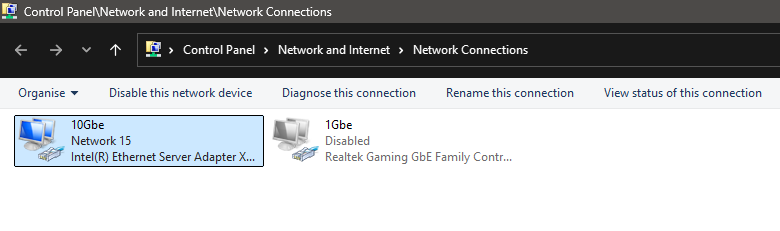

# Port Forwarding

!!! danger ":material-scale-balance: DISCLAIMER:"

    **Port forwarding is a risk**.

    By Port forwarding you understand the risks of opening up ports on your home network to the public and therefore void the right to hold BeamMP accountable for **any and all** damages that may happen to you or your household.

    We take no responsibility for any content on any externally linked services or websites.

    <u>**If you do not understand this guide, please consider using one of our partners.**</u>


## How To Set Up a Port Forward

Setting up a port forward involves a few detailed network terms. Be prepared to write down a few notes as you go through the process.

There are 4 major steps to setting up a port forward.

## A quick guide. (A more detailed guide is below)

        
        
        

<div class="grid cards" markdown>

-   :material-dns:{ .lg .middle } __Assign a static IP address to your computer or devices__

    ---
    This is needed to prevent the IP of your device changing and breaking the port forwarding rule.
    

    [:octicons-arrow-right-24: See info about your router](https://portforward.com/router.htm#1)

-   :material-router-wireless:{ .lg .middle } __Log in to your router__

    ---

    This can normally be done by finding the Default Gateway IP, which can be found using `ipconfig` in command prompt and enter this in on a web browser.

-   :material-lan-connect:{ .lg .middle } __Forward ports to your computer__

    ---

    Find the port forwarding section in your router menu. Most routers list the port forwarding section under Network, Advanced, or LAN.

-   :material-test-tube:{ .lg .middle } __Test that your port is forwarded properly__

    ---

    Use a tool such as ProbablyUp to test if the rule is working.

    [:octicons-arrow-right-24: Probably Up](https://probablyup.net/api)

</div>

## The detailed guide

### 1. Assigning a static IP address

### Method 1: Set Up a Static IP Address Using DHCP Reservations

Another way to set up a static IP address is to use your router's DHCP reservations feature. Not all routers have this feature, so this may not be an option for you. Please search the internet with the model of your router to find out if you can.

However, if your router does have this feature, it is an excellent choice for reserving a static IP address for all of the devices in your home. DHCP reservations allow you to centrally manage all of your home IP addresses from a single interface and will enable you to change settings on devices that you may otherwise not be able to edit. 

If you have managed to do this, please skip directly to [step 2](port-forwarding.md#2-log-in-to-your-router)

### Method 2: Assign a static IP in Windows

#### 1.1. Find your current IP Address, Gateway and DNS servers:


Before we can set up a static IP address, we need to know your current network settings. 
You are going to want to write these down, so get a notepad window ready. 
For this step, we are going to use command prompt.

Open up a command prompt. The 3 main ways are:

- Windows Key, then start typing the phrase "cmd", then press Enter when you see "Command Prompt" highlighted.
- Windows Key + R (opens the Run dialog box), followed by 'cmd', then Enter
- Right-click the Windows Icon, then choose 'Windows PowerShell' (white text on blue background)


<figure class="image image_resized" style="width:62%;" markdown>
  
</figure>

Once you are in the command prompt, run the following command:

```
ipconfig /all
```

You will see a lot of data. 
If you have virtual or multiple network adapters, then you will see even more data. 
It is common to see many virtual adapters if you have either Hyper-V or Docker installed.


<figure class="image image_resized" style="width:62%;" markdown>
  
</figure>

It is recommended to use a wired network connection which will be running this server, however, it will work over a wireless connection.
You will need to look for an adapter in this list which has valid settings. Scroll through the list and find one that has a Default Gateway assigned. 
Many of the virtual adapters will not have a Default Gateway. 
You need to find a Default Gateway that has a similar IP address to the IPv4 address listed for the adapter.

For instance, if you find an adapter with an IPv4 address that is 192.168.0.100, and the Default Gateway is 192.168.0.1, this is a suitable adapter.

You will need to note down the following information:

IPv4 Address, examples: 

- 192.168.x.x
- 10.x.x.x.
- 172.16.x.x - 172.31.x.x

Subnet Mask (most likely 255.255.255.0)
</br>
Default Gateway (most likely 192.168.0.1 or 192.168.1.1)

!!! info "Please Note"
    BeamMP currently does not support IPv6 for hosting a server. 

#### 1.2. Modify Adapter Settings

Now we need to change the settings on your network card or ethernet adapter. To get to the settings for your network, the fastest method is:

- Single tap the Windows key
- Type the phrase "network connections" until you see "View network connections".
- Press the Enter key


<figure class="image image_resized" style="width:62%;" markdown>
  
</figure>

You should see a list of network connections on your computer. 
If you have Hyper-V or Docker installed, there can be many. 
Look for any adapters that are not named "Hyper-V".

<figure class="image image_resized" style="width:62%;" markdown>
  
</figure>


Right-click on your adapter and choose properties. If `Internet Protocol Version 4` is not checked, then this is the wrong adapter. Choose a different one.

<figure class="image image_resized" style="width:62%;" markdown>
  
</figure>

Double click on `Internet Protocol Version 4`. Change `Obtain an IP address automatically` to `Use the following IP address`.

Fill out the IP address, Subnet mask, Default gateway, and Preferred DNS server with the information from command prompt (ipconfig /all).

Alternatively, instead of using your DNS servers, you can use either the CloudFlare or Google DNS servers:

- CloudFlare DNS: 1.1.1.1, 1.0.0.1
- Google DNS: 8.8.8.8, 8.8.4.4


<figure class="image image_resized" style="width:62%;" markdown>
  
</figure>

Click Ok, then click Ok again, and your adapter is now changed from DHCP to static. Surf the web to make sure that you still have internet connectivity. If you do not, then change your settings back to Obtain an IP address automatically and try the next method.

### 2. Log in to your router

Now that you have a static IP address on your device, you are ready to forward your port for BeamMP!

To start, we need to log in to your router. Earlier, one of the settings that you wrote down is your Default Gateway. That is the IP address of your router.

Most routers use a locally hosted web page for management. To view your router's menu and settings:

- Open up a web browser. Firefox, Chrome or Edge should work fine.
- In the address bar, type your Default Gateway IP address, such as 192.168.0.1 or 192.168.1.1 and press enter

You should now see your router's login screen. Not all routers require a login, but most do. You need to know your router's username and password. If you have never logged in before, your username and password are most likely set to the factory default values or, in some cases, written on the bottom of your router.

Some of the most common factory usernames and passwords are listed here:

| Username    | Password  |
| ----------- | --------- |
| admin       | admin     |
| admin       | password  |
| {blank}     | admin     |
| {blank}     | password  |

Try various combinations of admin, password, and leaving the entries blank. *Where it says blank, try leaving the value blank.* 

### 3. Create the forwarding rules!

#### 3.1. Find the forwarding section
Find the port forwarding section in your router menu. Navigate around in your router by clicking the tabs or links at the top or left of each page. Most routers list the port forwarding section under Network, Advanced, or LAN. Look for the following keywords to help you find it:

- Port Forwarding
- Forwarding
- Port Range Forwarding
- Virtual Servers
- Apps & Gaming
#### 3.2. Enter in the details

Once you find your router's port forwarding section, you are ready to enter the necessary information.
Your router will have a place to enter the ports to be forwarded and the destination IP address to point those forwarded ports. If your router lists both Internal and External ports, make them the same. 

BeamMP requires both UDP and TCP port 30814 (Unless you have changed this in your [ServerConfig.toml](create-a-server.md#4-configuration)). 


!!! info "Something to note:"
    While the default **Port** you want to “forward” is **30814**, you can choose any other number greater than 1024 but less than 65535, but you need to note down what you picked if it's not 30814\. You need to forward both **TCP** and **UDP**.
    </br>
    It is recommended to stick to the default port as that one is very unlikely to be used by another service on your PC.
    </br>
    However, If you are hosting multiple servers on one machine, each server needs a different Port. Server 1: 30814, Server 2: 30815 for example.

On some routers you may need to create 2 rules, one for UDP and one for TCP, whilst others are nice and allow you to do both with a single rule!

Most routers have a Save button, and some routers require a restart or reboot for the changes to take effect.

### 4. Time to test!

There are a few different ways to test the connection.

Our recommend way is to use a tool called [Probably Up](https://probablyup.net/api) as this tests for BeamMP specific issues and protocols.

This can be done by getting your public IPv4 Address, this once again can be done in a few different ways. The main way is to use a website called [icanhazip.com](https://icanhazip.com/). This is a very simple website which displays your public IP Address. You should be looking for an IP address with the formatting: xxx.xxx.xxx.xxx

<figure class="image image_resized" style="width:62%;" markdown>
  
</figure>

Once you have entered in the information required, click on Run test and it should put out something like this:

<figure class="image image_resized" style="width:62%;" markdown>
  
</figure>

If you get the output above you can now join your server!
You have 2 ways to join, either directly with the details you entered into Probably UP, or, if your server is public, through the server-list.

## Still not working?

Please open a Server Support ticket on our [Discord server](https://discord.gg/beammp) in the `#support` channel and one of our staff will get to your ticket!