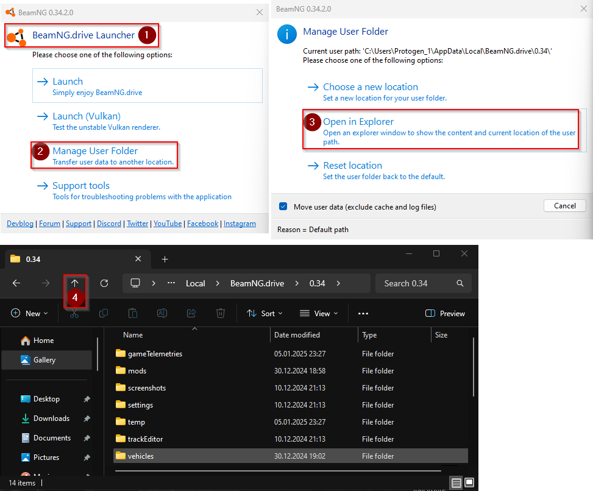

## Pourquoi dois-je désactiver mes mods ?

Dans BeamMP, le serveur auquel vous vous connectez fournit les mods nécessaires. Ceux-ci sont téléchargés et activés automatiquement lors de la connexion. L'installation et l'activation de mods locaux peuvent souvent entraîner un dysfonctionnement de BeamMP, même avec un seul mod supplémentaire.

!!! warning

```
Supprimez tous les mods placés dans le dossier BeamNG.Drive\content\ ou ses sous-dossiers. Cet emplacement n'est PAS destiné à l'installation de mods et peut entraîner des problèmes, comme indiqué dans le fichier « DO_NOT_INSTALL_MODS_HERE.txt », situé dans le même répertoire.

!!! quote 'DO_NOT_INSTALL_MODS_HERE.txt"

NE copiez PAS les mods dans ce dossier : cela peut entraîner des mods cassés, une installation plus lente des mises à jour, un gestionnaire de mods cassé, un mode sans échec cassé et autres.
```

## Comment désactiver/supprimer mes mods ?

Il existe 3 options pour résoudre les problèmes possibles lors de l'utilisation de BeamMP.

### 1. Désactiver les mods

Avant de rejoindre un serveur, assurez-vous qu'aucun mod autre que « multiplayerbeammp » n'est activé. Si le jeu se bloque ou si vous rencontrez toujours des problèmes, reportez-vous à l'option suivante.

### 2. Création d'un nouveau dossier utilisateur

Ouvrez le dossier utilisateur BeamNG.Drive et renommez le dossier de la dernière version (par exemple 0.35) en 0.xx_OLD (0.35_OLD). Fermez BeamNG.drive avant de le renommer. 

### 3. Suppression des mods des dossiers de contenu.

Pour accéder au dossier Beamng.drive\content\ et le vider de tout mod, ouvrez l'emplacement d'installation de BeamNG.drive. Faites un clic droit sur le dossier `content` et supprimez-le. Procédez à la vérification des fichiers du jeu via Steam ou Epic Games. Les fichiers seront alors à nouveau téléchargés.

Une fois terminé, lancez BeamNG.Drive via le lanceur BeamMP. Le seul mod activé dans le dépôt devrait être « multiplayerbeammp », ainsi que le bouton d'accès à BeamMP dans le menu principal. Si vous rencontrez toujours des difficultés pour rejoindre un serveur moddé, il est probable que des mods défectueux ou obsolètes soient disponibles.

### 4. Nettoyage du cache de BeamMP-Launcher

Pour nettoyer les mods en cache des répertoires BeamMP, accédez à l'emplacement d'installation de votre lanceur BeamMP. Par défaut, le chemin est « C:\Users\AppData\BeamMP-Launcher ». Vous y trouverez un dossier « Resources ». Supprimez ce dossier pour supprimer tous les mods en cache. Cela peut être utile si vous avez besoin de plus d'espace disque ou si vous souhaitez supprimer des mods BeamNG obsolètes.

!!! question "Mes paramètres et configurations ont disparu ! Comment puis-je les restaurer ?"

```
Si vous avez renommé le dossier utilisateur, vous avez forcé le jeu à créer un nouveau dossier utilisateur propre. Vous pouvez copier les dossiers « paramètres » et « véhicules » du dossier renommé (par exemple, 0.34_OLD) vers le nouveau dossier créé.
Assurez-vous que BeamNG.Drive est fermé et remplacez tous les éléments à l'emplacement où vous souhaitez copier les dossiers. Toutes les configurations et tous les paramètres devraient maintenant être identiques.
```
