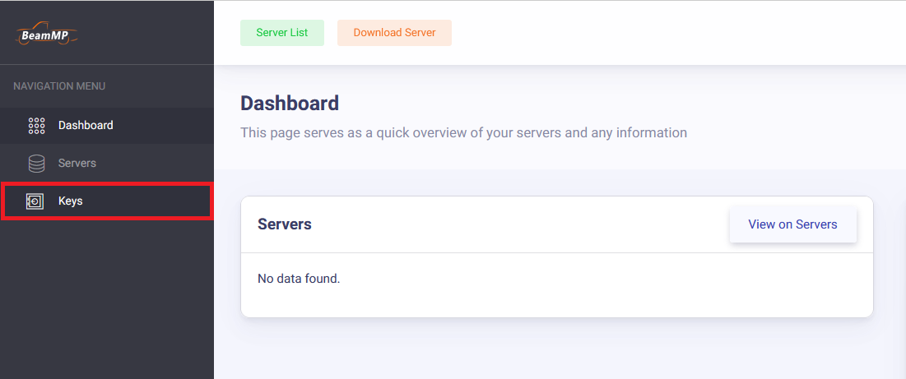
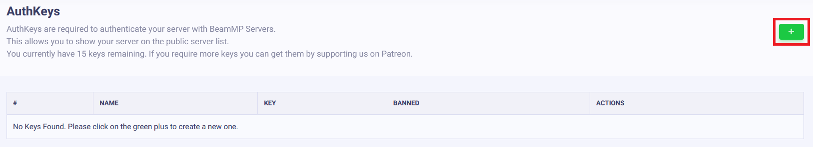
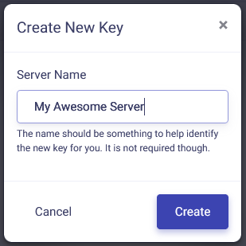
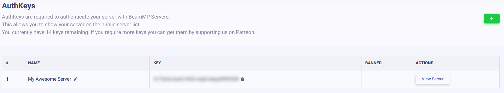
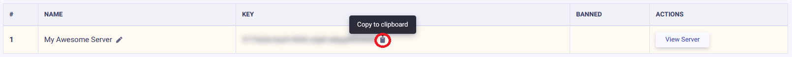
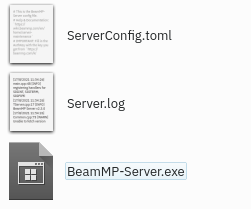

# Installation du serveur

## **Création d'un serveur**

Principes de base de la configuration de l'application serveur
---

### **Introduction**

**La création d'un serveur est gratuite, l'héberger avec un VPS est plus facile et plus sûr.**

Les serveurs font partie intégrante de BeamMP ; les joueurs sont connectés les uns aux autres par l'intermédiaire du serveur. Ils fonctionnent nativement sous Windows et Linux

Vous pouvez créer des serveurs privés, auxquels seules les personnes que vous invitez peuvent accéder, ou des serveurs publics, qui apparaîtront dans notre liste officielle de serveurs.

Mettre en place un serveur se fait en quelques étapes !
- Si vous rencontrez des problèmes, n'hésitez pas à nous contacter sur notre [forum](https://forum.beammp.com) ou sur notre [serveur Discord](https://discord.gg/beammp) dans le canal `❔-support` . 
- Consultez également la section [maintenance du serveur](server-maintenance.md) pour plus d'informations.

Veuillez vous assurer d’avoir lu la [LICENCE](https://raw.githubusercontent.com/BeamMP/BeamMP-Server/master/LICENSE) du serveur avant toute utilisation.

!!! note
             
    Remarque : *Le serveur prend uniquement en charge l’IPv4. Si vous ne savez pas quelle version vous utilisez, vous pouvez consulter votre adresse IP sur [whatsmyip.org](https://www.whatsmyip.org/)*. Si celle-ci contient deux-points (`_:_`), il s’agit d’une adresse* ***IPv6***. Dans ce cas, vérifiez auprès de votre fournisseur d’accès à Internet si vous disposez également d’une adresse IPv4. 
    
    Vous pouvez également demander de l’aide à une personne ayant des connaissances en informatique. La prise en charge de l’IPv6 est prévue ultérieurement.


## Configuration du serveur

La configuration se déroule en plusieurs étapes, qui doivent toutes être suivies.

### **1. Redirection de port**

!!! info

    Si vous utilisez un VPS (Virtual Private Server), un serveur dédié avec accès root, ou si vous prévoyez d’héberger le serveur uniquement en local, avec des joueurs connectés depuis le même domicile que vous, vous pouvez passer cette étape.

    Cette étape est uniquement nécessaire si vous souhaitez permettre à des joueurs extérieurs à votre domicile de rejoindre votre serveur hébergé localement, c’est-à-dire depuis l’extérieur de votre réseau local.

!!! danger " AVERTISSEMENT :"

**Le transfert de port est un risque**.

En configurant une redirection de port, vous reconnaissez les risques liés à l’ouverture d’un port de votre réseau domestique sur Internet. Vous acceptez donc que **BeamMP ne puisse être tenu responsable des éventuels dommages** pouvant en résulter pour vous ou votre foyer.

Nous ne sommes pas responsables du contenu, du fonctionnement ou de la sécurité des services et sites web externes.

Pour limiter les risques, nous vous recommandons d’héberger votre serveur auprès de l’un de nos services partenaires.

*Pour savoir comment configurer une redirection de port, veuillez consulter* *[ce guide](https://docs.beammp.com/server/port-forwarding/)*.


#### Services d'hébergement partenaires (payants) :

- [Horizon Hosting](https://hrzn.link/beammp)
- [RackGenius](https://rackgeni.us/beammp-plans)
- [Connect Hosting](https://connecthosting.net/beammp)
- [Assetto Hosting](https://assettohosting.com/en/games/beamng)
- [Zap Hosting](https://zap-hosting.com/en/beammp-server-hosting/)
- [HostHavoc](https://hosthavoc.com/)
- [PedalHost](https://pedal.host/)
- [Vyper Hosting](https://vyperhosting.com/r/beammp)
- [BisectHosting](https://www.bisecthosting.com/beammp-server-hosting)
- [Four Seasons Hosting](https://fourseasonshosting.com)
- [Vertuo Hosting](https://vertuohosting.com)
- [Winheberg](https://winheberg.fr/offres/gaming/beammp?lang=en)

#### 1.1 Pare-feu

Selon votre configuration, il peut être nécessaire d’autoriser **BeamMP-Server** à communiquer à travers votre pare-feu. Cela concerne notamment Windows, où la désactivation du pare-feu est généralement **inefficace**, ainsi que de nombreux serveurs Linux préconfigurés.

Vous devez autoriser **BeamMP-Server** à accepter les connexions **entrantes et sortantes**, en **TCP et UDP**. Si votre pare-feu vous demande de spécifier un port, utilisez le même que celui configuré à l’étape **« 1. Redirection de port »**, généralement **30814**.

Si vous rencontrez des difficultés, vous pouvez également demander de l’aide sur notre [forum](https://forum.beammp.com) ou sur notre [serveur Discord](https://discord.gg/beammp), dans le canal `❔-support`.


### **2. Obtenir une clé d’authentification**

La clé d’authentification, souvent appelée **« AuthKey »**, est nécessaire pour qu’un serveur **public** puisse apparaître dans la liste des serveurs. Il est néanmoins recommandé d’en utiliser une également pour les serveurs privés.

Le nombre de clés d’authentification disponibles est limité. **Une même clé ne peut être utilisée que par un seul serveur à la fois** : vous ne pouvez donc pas démarrer simultanément deux serveurs avec la même clé.

Vous pouvez obtenir des clés supplémentaires en soutenant le projet. Pour plus d’informations, consultez [cet article](https://docs.beammp.com/support/player-faq/).


!!! warning

     NE PARTAGEZ JAMAIS CETTE CLÉ ET NE LA MONTREZ À PERSONNE. TRAITEZ CECI COMME UN MOT DE PASSE.

Vous aurez besoin d'un compte [Discord](https://discord.com/register) pour cette étape. Ceci est indispensable pour éviter le spam.

#### 2.1. Accès à la page des clés

Connectez-vous à [Keymaster](https://keymaster.beammp.com/) via Discord. Depuis la page d'accueil de Keymaster, cliquez sur « AuthKeys » à gauche de l'écran :

<figure markdown>
  
</figure>

#### 2.2. Création d'une clé

Pour créer votre clé, cliquez sur le bouton vert "+" en haut à droite.

<figure markdown>
  
</figure>

#### 2.3. Remplir les informations clés

Ensuite, remplissez le champ `Server Name` (il s'agit uniquement du nom de la clé, et non du nom réel du serveur dans la liste), puis cliquez sur `Create`. Exemple :

<figure class="image image_resized" style="width:44.84%;" markdown>
  
</figure>

Cela devrait, au final, ressembler à ceci :

<figure markdown>
  
</figure>

#### 2.4. Copie de la clé

Copiez maintenant le texte dans le champ « Clé », dans cet exemple : `3173a2e-6az0-4542-a3p0-ddqq5ff95558` et conservez-le pour l'étape suivante. Pour ce faire, cliquez sur le presse-papiers à droite de la clé :

<figure markdown>
  
</figure>

### **3. Installation**

Le serveur BeamMP est disponible pour Windows et Linux. Les deux sections suivantes sont consacrées à Windows et Linux.

#### 3.a. Installation sous Windows

- Pour l’installation de Linux, voir l’étape suivante.

Assurez-vous d'avoir redirigé vos ports avant d'héberger un serveur chez vous ! Sans redirection de port, vous ne pourrez pas héberger de serveur public !

1. Assurez-vous d’avoir installé le [redistribuables de Visual C++](https://aka.ms/vs/17/release/vc_redist.x64.exe) afin d’exécuter le serveur.
2. Téléchargez l'exécutable du serveur depuis [beammp.com](https://www.beammp.com/). Vous devriez obtenir un fichier exécutable, nommé par exemple `BeamMP-Server.exe`
3. Une fois téléchargé, créez un dossier et placez-y le `BeamMP-Server.exe` . C'est là que votre serveur sera hébergé.
4. Démarrez le serveur en double-cliquant dessus. Tous les fichiers nécessaires seront alors générés. Une fois le texte affiché, vous pourrez le fermer et passer à l'étape suivante. Vous devriez voir un fichier `ServerConfig.toml` à côté de votre `BeamMP-Server.exe`
5. (facultatif) Pour un accès rapide à l'avenir, vous pouvez facilement créer un raccourci sur le bureau vers `BeamMP-Server.exe` en utilisant **[Clic droit]** &gt; **Envoyer vers** &gt; **Bureau (créer un raccourci).**

Passez maintenant à l’étape 4 - [Configuration](#4-configuration) .

#### 3.b. Installation sous Linux

##### Utilisation de notre build (recommandé)

Cette étape fonctionne sur toutes les distributions pour lesquelles nous fournissons des binaires [ici](https://github.com/BeamMP/BeamMP-Server/releases/latest). Si vous utilisez une distribution ou une architecture différente, reportez-vous à l'étape `Création à partir des sources` ci-dessous.

1. Assurez-vous que les dépendances répertoriées [ici](https://github.com/BeamMP/BeamMP-Server#runtime-dependencies) sont installées.
2. Accédez à [beammp.com](https://beammp.com/), scroller tout en bas et cliquez sur le bouton `Windows Server` ou `Linux Builds`, vous serez redirigé vers la page de publication Github du serveur.
3. Téléchargez la version adaptée à votre distribution. Par souci de simplicité, elle s'appellera désormais `BeamMP-Server-xxx` où `xxx` désigne la version de la distribution que vous utilisez.
4. Une fois téléchargé, vous devriez voir un fichier nommé `BeamMP-Server-xxx`, parmi d'autres que vous pouvez ignorer pour l'instant. Créez un dossier et placez-y `BeamMP-Server-xxx`. C'est là que votre serveur sera hébergé.
5. Ouvrez un terminal, accédez au dossier où se trouve `BeamMP-Server-xxx` et exécutez `chmod +x BeamMP-Server-xxx`. Cela vous permet de vous assurer que vous disposez des autorisations nécessaires pour l'exécuter.
6. Démarrez le serveur une fois en l'exécutant avec `./BeamMP-Server-xxx`. Cela générera tous les fichiers nécessaires. Une fois le texte affiché, vous pourrez le fermer et passer à l'étape suivante. Vous devriez voir un fichier `ServerConfig.toml` à côté de votre `BeamMP-Server-xxx`.
7. (facultatif) Il est fortement recommandé de créer un utilisateur dédié nommé `beammpserver` (ou un nom similaire). Pour des raisons de sécurité, évitez d’exécuter le serveur avec les privilèges `root`, via `sudo` ou avec votre compte utilisateur personnel. Veillez ensuite à toujours lancer le serveur avec cet utilisateur dédié.


Passez maintenant à l’étape 4 - [Configuration](#4-configuration) .

##### Construire à partir de la source

D’autres distributions, en plus de celles pour lesquelles un binaire est déjà disponible sur [GitHub](https://github.com/BeamMP/BeamMP-Server/releases/latest), peuvent également fonctionner, mais ne sont pas officiellement prises en charge. 
- Si vous souhaitez compiler le serveur vous-même, vous pouvez récupérer le code source sur notre [GitHub](https://github.com/BeamMP/BeamMP-Server). Les instructions de compilation sont disponibles [ici](https://github.com/BeamMP/BeamMP-Server#build-instructions).


À la fin, assurez-vous d’exécuter votre serveur une fois avec `./BeamMP-Server`, puis passez à l’étape suivante.

### **4. Configuration**

Après avoir exécuté le serveur une première fois, celui-ci devrait avoir créé plusieurs fichiers et probablement généré une ou deux erreurs. C’est normal à ce stade, car la configuration n’est pas encore terminée. Votre dossier devrait maintenant contenir les fichiers suivants :

<figure markdown>
  
</figure>

Ils s’appellent `ServerConfig.toml`, `Server.log` et `BeamMP-Server.exe` ! Selon vos paramètres système, les extensions `.toml`, `.log` et `.exe` peuvent ne pas être affichées.


Ouvrez le fichier `ServerConfig.toml` avec un éditeur de texte, tel que `Notepad`. Pour cela, faites un clic droit sur le fichier, sélectionnez **« Ouvrir avec… »**, puis choisissez votre éditeur de texte.


Vous devriez voir quelque chose comme ceci :

```TOML
[General]
AuthKey = ''
Debug = false
Description = 'BeamMP Default Description'
Map = '/levels/gridmap_v2/info.json'
MaxCars = 1
MaxPlayers = 10
Name = 'BeamMP Server'
Port = 30814
Private = false
ResourceFolder = 'Resources'
```

Il s’agit de votre fichier de configuration, qui utilise le format TOML. Pour en savoir plus sur ce fichier et ses paramètres, consultez la section [Maintenance du serveur](https://docs.beammp.com/fr/server/server-maintenance/).

Pour le moment, seul le champ `AuthKey` nous intéresse. Collez la clé que vous avez copiée à la première étape entre les guillemets `''`.

Pour notre exemple de clé, cela devrait alors ressembler à ceci :

```TOML
AuthKey = '3173a2e-6az0-4542-a3p0-ddqq5ff95558'
```

Donnez également un nom à votre serveur dans le champ `Name`. Vous pouvez personnaliser son apparence en ajoutant des couleurs et d’autres options. Pour plus d’informations, consultez la section [Personnalisation du nom](server-maintenance.md#customize-the-look-of-your-server-name) de la page dédiée à la maintenance du serveur.


Si vous avez choisi un **port** différent de **30814** , assurez-vous de le remplacer dans le champ `Port`.

!!! info
        
        Votre serveur n’apparaîtra **PAS** dans la liste des serveurs si le champ `Private` est défini sur `true`. *Si* vous souhaitez qu’il soit visible dans la liste, définissez-le sur **`Private = false`**.

### **5. Validation**

Redémarrez votre serveur et vérifiez si d’autres messages `[ERROR]` ou `[WARN]` apparaissent. Le serveur devrait rester ouvert. L’étape suivante (6) vous expliquera comment rejoindre votre serveur.


---

#### 5.1 Comment ajouter des mods à votre serveur

L’installation des mods de véhicules et de cartes est différente, mais ils doivent tous deux être placés dans le dossier `Resources/Client` de votre serveur. Il vous suffit de glisser-déposer le mod souhaité dans ce dossier.


!!! warning

Si vous recevez un message « terminé » ou « démarrer » lorsque vous essayez de rejoindre votre serveur après avoir ajouté des mods, il est probable que vous ayez installé un mod incompatible ou défectueux.

Des conflits peuvent également survenir entre deux ou plusieurs mods. Si vous avez installé des mods côté client, consultez ce guide pour savoir comment les supprimer de votre jeu.

#### 5.2 Mods généraux

Si vous souhaitez uniquement ajouter des véhicules moddés, placez simplement le fichier zip du mod dans le dossier `Resources/Client`. Il sera automatiquement téléchargé par toute personne rejoignant votre serveur.

#### 5.3 Cartes

Toutes les cartes par défaut (hors mods) sont prêtes à l’emploi et ne nécessitent aucune installation. Il vous suffit de modifier le paramètre `Map` dans le fichier `ServerConfig.toml` et de choisir l’une des [cartes disponibles](https://docs.beammp.com/fr/server/server-maintenance/#all-vanilla-maps-names).

Pour installer une carte modifiée, procédez comme suit :

1. Placez le fichier `.zip` de votre carte dans le dossier `Resources/Client` de votre serveur.
2. Ouvrez le fichier `.zip` de la carte **sans l’extraire**, puis ouvrez le dossier `levels`. Celui-ci doit contenir un autre dossier portant le nom de la carte, par exemple `myawesomedriftmap2021`. Copiez ou mémorisez ce nom **exactement comme il apparaît dans le dossier**.
3. Ouvrez votre fichier `ServerConfig.toml`. Dans le paramètre `Map`, vous devriez voir `/levels/MAPNAME/info.json`, où `MAPNAME` correspond probablement à un nom tel que `gridmap_v2`. Remplacez `MAPNAME` par le nom du dossier trouvé à l’étape précédente. Dans notre exemple, il s’agit de `myawesomedriftmap2021`.

Le résultat devrait donc ressembler à ceci dans cet exemple et **doit impérativement contenir** `/info.json`.


```TOML
Map = '/levels/myawesomedriftmap2021/info.json'
```

Désormais, lorsqu’un joueur rejoint votre serveur, il devrait télécharger automatiquement la carte et pouvoir l’utiliser normalement.

**Si cela ne fonctionne pas**, installez la carte sur votre version locale de BeamNG.drive, lancez le jeu et chargez la carte concernée. Ouvrez ensuite la console en appuyant sur la touche `~`. Si vous utilisez un clavier non américain, recherchez l’action **« Basculer la console système »** dans **Options > Contrôles > Liaisons**, sous la section **« Débogage général »**.

Dans la console, exécutez ensuite la commande suivante :

`print(getMissionFilename())`

Le nom à utiliser pour le paramètre `Map` devrait alors s’afficher.

Et voilà ! Votre carte modifiée devrait maintenant être disponible sur votre serveur !


### **6. Comment rejoindre votre serveur**

Découvrez comment vous et les autres joueurs pouvez rejoindre votre serveur.

#### 6.a. Rejoindre votre propre serveur (privé ou public)

Si votre serveur est hébergé sur le même PC que celui sur lequel le jeu est exécuté, vous devez vous y connecter directement. Pour cela, cliquez sur l’**onglet « Connexion directe »** situé à gauche de la liste des serveurs. Laissez les informations par défaut (`127.0.0.1` et le port correspondant), puis cliquez sur **« Se connecter »**.

Si votre serveur est hébergé sur un autre PC de votre réseau local, recherchez l’adresse IP locale de cette machine, puis connectez-vous directement à l’aide de cette adresse IP.

Si votre serveur est hébergé en dehors de votre domicile, par exemple sur un VPS, recherchez l’[adresse IP publique](https://whatismyipaddress.com/) de cette machine, puis utilisez-la pour vous connecter directement.

#### 6.b. D’autres personnes rejoignent votre serveur privé

Vous devez communiquer l’adresse IP publique de votre serveur aux autres joueurs. **Attention toutefois à ne pas la partager avec des personnes de confiance uniquement !**

Pour rejoindre votre serveur privé, les joueurs doivent accéder à l’**onglet « Connexion directe »** de BeamMP, puis saisir l’adresse IP et le port de votre serveur.

#### 6.c. D’autres personnes rejoignent votre serveur public

Pour rejoindre votre serveur public, il suffit d’ouvrir la liste des serveurs, de rechercher son nom, puis de cliquer sur **« Se connecter »**.

En cas de doute, le nom de votre serveur correspond à celui que vous avez défini dans le fichier `ServerConfig.toml`. Si vous ne le trouvez pas, vérifiez que les filtres de recherche sont désactivés et que la carte est définie sur **« Tout »**.

Vous pouvez également consulter le site web de [Keymaster](https://keymaster.beammp.com/login) pour connaître l’adresse IP de votre serveur.

Si vous ou vos amis rencontrez l’erreur **« Échec de la connexion ! »**, recherchez des codes tels que `10060`, `10061` ou `10030` dans la fenêtre de lancement. Cela peut indiquer que vous utilisez une IPv4 derrière un CGNAT ou qu’une erreur s’est produite lors de l’**étape 1 de la redirection de port** ou de la **section 1.1 concernant le pare-feu**.

Pour vérifier si vous utilisez une IPv4 derrière un CGNAT, consultez l’adresse IP WAN affichée dans l’interface de votre routeur et comparez-la à votre [adresse IP publique](https://www.whatsmyip.org/). Si les deux adresses sont différentes, vous êtes probablement derrière un CGNAT. La prise en charge d’IPv6 **n’est pas encore implémentée**.

### **7. Comment vérifier la connectivité de votre serveur BeamMP**

Saisissez l’adresse IPv4 publique et le port de votre serveur ci-dessous, puis cliquez sur **« CheckBeamMP »**.

```html
<form action="https://check.beammp.com/api/v2/beammp" method="get" target="_blank">
  <label for="ip">Adresse IP :</label>
  <input type="text" id="ip" name="ip"><br>
  <label for="port">Port :</label>
  <input type="text" id="port" name="port"><br>
  <input type="submit" value="CheckBeamMP">
</form>
```

!!! warning "Je souhaite utiliser un VPN tel que RadminVPN, Hamachi ou similaire."

BeamMP ne prend pas en charge ces VPN, car ils peuvent fréquemment provoquer des problèmes, notamment en empêchant le transfert du trafic UDP. Pour résoudre ce problème, consultez la section 1.

!!! question "Mais pourquoi cela fonctionnait-il auparavant ?"

Cela peut s’expliquer par des mises à jour ou des modifications apportées par les développeurs de ces applications, sur lesquelles BeamMP n’a aucun contrôle.

Il appartient aux développeurs de ces applications d’assurer la compatibilité avec des cas d’utilisation spécifiques, comme l’hébergement d’un serveur BeamMP.

## Vous rencontrez toujours des problèmes ?

Ouvrez un sujet sur le [forum](https://forum.beammp.com) ou demandez de l’aide sur notre [serveur Discord](https://discord.gg/beammp), dans le canal `❔-support`.
