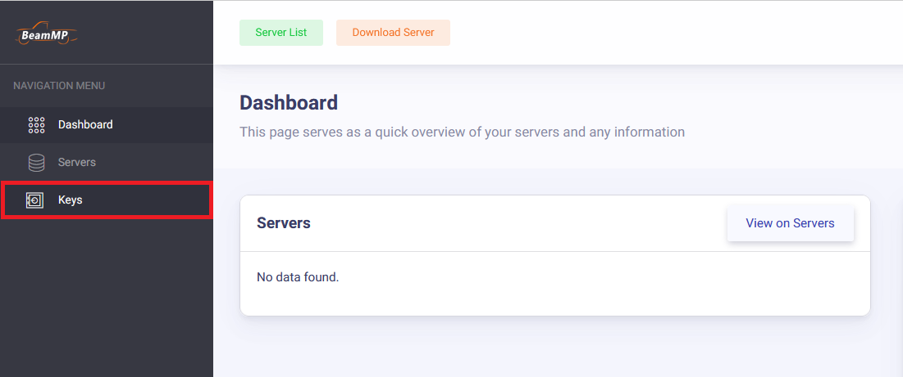
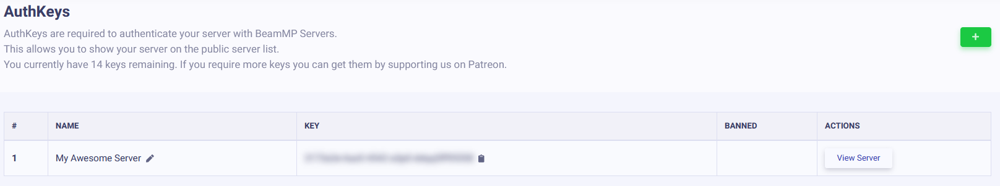

# Installation du serveur

## **Création d'un serveur**

Notions de base sur la configuration de l'application serveur

---

### **Aperçu**

**La création d'un serveur est gratuite, l'héberger avec un VPS est plus facile et plus sûr.**

Les serveurs font partie intégrante de BeamMP ; les joueurs sont connectés les uns aux autres par l'intermédiaire du serveur. Ils fonctionnent nativement sous Windows et Linux

Vous pouvez créer des serveurs privés, auxquels seules les personnes que vous invitez peuvent accéder, ou des serveurs publics, qui apparaîtront dans notre liste officielle de serveurs.

Mettre en place un serveur se fait en quelques étapes ! Si vous rencontrez des problèmes, n'hésitez pas à nous contacter sur notre [forum](https://forum.beammp.com) ou sur notre [serveur Discord](https://discord.gg/beammp) dans le canal `#support` . Consultez également la section [Maintenance du serveur](server-maintenance.md) pour plus d'informations.

Veuillez vous assurer de lire la[LICENCE](https://raw.githubusercontent.com/BeamMP/BeamMP-Server/master/LICENSE) du serveur avant utilisation.

Remarque : *Le serveur ne prend en charge que l'IPv4. Si vous ne savez pas lequel vous utilisez, regardez l'adresse IP affichée sur [*whatsmyip.org*](https://www.whatsmyip.org/) : si elle contient* des deux points `_:_` *, il s'agit **d'IPv6** . Dans ce cas, vérifiez si vous utilisez également une adresse IPv4. Vous pouvez contacter votre FAI pour le savoir, ou demander à un proche (s'il est doué en informatique, il le saura peut-être !). La prise en charge d'IPv6 est prévue.*

## Configuration du serveur

La configuration comprend les étapes suivantes, vous devez toutes les suivre.

### **1. Redirection de port**

!!! info

```
Si vous êtes sur un VPS (Virtual Private Server), un Rootserver, ou si vous prévoyez d'héberger ce serveur localement (avec des joueurs dans la même maison que vous), vous pouvez sauter cette étape.
Cette étape est nécessaire si vous voulez que quelqu'un **en dehors** de votre foyer rejoigne votre serveur hébergé localement (en dehors de votre réseau local).

! !! danger ":material-scale-balance: AVERTISSEMENT :"

**Le transfert de port est un risque**.

En transférant des ports, vous comprenez les risques liés à l'ouverture au public des ports de votre réseau domestique et vous annulez donc le droit de tenir BeamMP pour responsable de **tous** les dommages qui pourraient survenir à vous ou à votre foyer.

Nous ne sommes pas responsables du contenu des services ou sites web externes.

Il est donc recommandé d'héberger un serveur avec l'un de nos services partenaires !

*Veuillez consulter [ce guide sur la façon de rediriger un port](port-forwarding.md)*.
```

#### Services d'hébergement partenaires (payants) :

- [Horizon Hosting](https://hrzn.link/beammp)
- [RackGenius](https://rackgeni.us/beammp-plans)
- [Connect Hosting](https://connecthosting.net/beammp)
- [Assetto Hosting](https://assettohosting.com/en/games/beamng)
- [Zap Hosting](https://zap-hosting.com/en/beammp-server-hosting/)
- [HostHavoc](https://hosthavoc.com/)
- [PedalHost](https://pedal.host/)
- [Vyper Hosting](https://vyperhosting.com/r/beammp)
- [BisectHosting](https://www.bisecthosting.com/beammp-server-hosting)
- [Four Seasons Hosting](https://fourseasonshosting.com)
- [Vertuo Hosting](https://vertuohosting.com)
- [Winheberg](https://winheberg.fr/offres/gaming/beammp?lang=en)

#### 1.1 Pare-feu

Selon votre configuration, vous devrez peut-être autoriser BeamMP-Server à traverser votre pare-feu. C'est le cas sous Windows (la désactivation du pare-feu est généralement **inefficace** ) et sur de nombreux serveurs Linux préinstallés.

Vous devez autoriser le serveur BeamMP à traverser le pare-feu, **pour les connexions entrantes et sortantes** , ainsi que **pour les protocoles TCP et UDP** . Si votre pare-feu vous demande un port, il devra être identique à celui utilisé à l'étape « 1. Redirection de port » (généralement 30814).

Si vous rencontrez des problèmes, n'hésitez pas à les poser également sur notre [forum](https://forum.beammp.com) ou sur notre [serveur Discord](https://discord.gg/beammp) dans le canal `#support` .

### **2. Obtaining an Authentication Key**

La clé d'authentification, souvent appelée « AuthKey », est nécessaire pour rendre un serveur **public** accessible à la liste des serveurs. Il est toutefois recommandé d'ajouter également la clé d'authentification aux serveurs privés. Le nombre de clés est limité. Une clé peut être utilisée sur un serveur à la fois ; vous ne pouvez donc pas démarrer deux serveurs simultanément avec la même clé. Vous pouvez obtenir davantage de clés en soutenant le projet. Consultez [cet article](https://docs.beammp.com/support/player-faq/) pour plus d'informations.

!!! warning

```
NE PARTAGEZ JAMAIS CETTE CLÉ ET NE LA MONTREZ À PERSONNE. TRAITEZ CECI COMME UN MOT DE PASSE.
```

Vous aurez besoin d'un compte [Discord](https://discord.com) pour cette étape. Ceci est indispensable pour éviter le spam.

#### 2.1. Accès à la page des clés

Connectez-vous à [Keymaster](https://beammp.com/keymaster) via Discord. Depuis la page d'accueil de Keymaster, cliquez sur « Clés » à gauche de l'écran :

<figure markdown="">    </figure>

#### 2.2. Création d'une clé

Pour créer votre clé, cliquez sur le bouton vert "+" en haut à droite.

<figure markdown="">    </figure>

#### 2.3. Remplir les informations clés

Ensuite, remplissez le champ Nom du serveur (il s'agit uniquement du nom de la clé, et non du nom réel du serveur dans la liste), puis cliquez sur « Créer ». Exemple :

<figure class="image image_resized" style="width:44.84%;" markdown="">    </figure>

Cela devrait, au final, ressembler à ceci :

<figure markdown="">    </figure>

#### 2.4. Copie de la clé

Copiez maintenant le texte dans le champ « Clé », dans cet exemple : `3173a2e-6az0-4542-a3p0-ddqq5ff95558` et conservez-le pour l'étape suivante. Pour ce faire, cliquez sur le presse-papiers à droite de la clé :

<figure markdown="">    </figure>

### **3. Installation**

Le serveur BeamMP est disponible pour Windows et Linux. Les deux sections suivantes sont consacrées à Windows et Linux.

#### 3.a. Installation sous Windows

Pour l’installation de Linux, voir l’étape suivante.

Assurez-vous d'avoir redirigé vos ports avant d'héberger un serveur chez vous ! Sans redirection de port, vous ne pourrez pas héberger de serveur public !

1. Assurez-vous d’avoir installé le [redistribuables de Visual C++](https://aka.ms/vs/17/release/vc_redist.x64.exe) afin d’exécuter le serveur.
2. Téléchargez l'exécutable du serveur depuis [beammp.com](https://www.beammp.com/) . Vous devriez obtenir un fichier exécutable, nommé par exemple `BeamMP-Server.exe` .
3. Une fois téléchargé, créez un dossier et placez-y le `BeamMP-Server.exe` . C'est là que votre serveur sera hébergé.
4. Démarrez le serveur en double-cliquant dessus. Tous les fichiers nécessaires seront alors générés. Une fois le texte affiché, vous pourrez le fermer et passer à l'étape suivante. Vous devriez voir un fichier `ServerConfig.toml` à côté de votre `BeamMP-Server.exe` .
5. (facultatif) Pour un accès rapide à l'avenir, vous pouvez facilement créer un raccourci sur le bureau vers `BeamMP-Server.exe` en utilisant **[Clic droit]** &gt; **Envoyer vers** &gt; **Bureau (créer un raccourci).**

Passez maintenant à l’étape [4. Configuration](#4-configuration) .

#### 3.b. Installation sous Linux

##### Utilisation de notre build (recommandé)

Cette étape fonctionne sur toutes les distributions pour lesquelles nous fournissons des binaires [ici](https://github.com/BeamMP/BeamMP-Server/releases/latest) . Si vous utilisez une distribution ou une architecture différente, reportez-vous à l'étape « Création à partir des sources » ci-dessous.

1. Assurez-vous que les dépendances répertoriées [ici](https://github.com/BeamMP/BeamMP-Server#runtime-dependencies) sont installées.
2. Accédez à [beammp.com](https://beammp.com/) et cliquez sur le bouton « Télécharger le serveur », vous serez redirigé vers la page de publication Github du serveur.
3. Téléchargez la version adaptée à votre distribution. Par souci de simplicité, elle s'appellera désormais `BeamMP-Server-xxx` , où `xxx` désigne la version de la distribution que vous utilisez.
4. Une fois téléchargé, vous devriez voir un fichier nommé `BeamMP-Server-xxx` , parmi d'autres que vous pouvez ignorer pour l'instant. Créez un dossier et placez-y `BeamMP-Server-xxx` . C'est là que votre serveur sera hébergé.
5. Ouvrez un terminal, accédez au dossier où se trouve `BeamMP-Server-xxx` et exécutez `chmod +x BeamMP-Server-xxx` . Cela vous permet de vous assurer que vous disposez des autorisations nécessaires pour l'exécuter.
6. Démarrez le serveur une fois en l'exécutant avec `./BeamMP-Server-xxx` . Cela générera tous les fichiers nécessaires. Une fois le texte affiché, vous pourrez le fermer et passer à l'étape suivante. Vous devriez voir un fichier `ServerConfig.toml` à côté de votre `BeamMP-Server-xxx` .
7. (facultatif) Il est fortement recommandé de configurer un utilisateur nommé `beammpserver` (ou similaire), car nous déconseillons d'exécuter le serveur en tant que root, sudo ou avec votre compte utilisateur personnel. Assurez-vous ensuite de démarrer le serveur uniquement avec cet utilisateur.

Passez maintenant à l'étape « 4. Configuration ».

##### Construire à partir de la source

D'autres distributions, outre celles disposant déjà d'un binaire [,](https://github.com/BeamMP/BeamMP-Server/releases/latest) sont susceptibles de fonctionner, mais ne sont pas officiellement prises en charge. Si vous souhaitez le compiler vous-même, vous pouvez le faire en téléchargeant le code source sur notre [GitHub](https://github.com/BeamMP/BeamMP-Server) . Un tutoriel est disponible [ici](https://github.com/BeamMP/BeamMP-Server#build-instructions) .

À la fin, assurez-vous d’exécuter votre serveur une fois avec `./BeamMP-Server` , puis passez à l’étape suivante.

### **4. Configuration**

Après avoir exécuté le serveur une fois, il devrait avoir créé des fichiers et probablement généré une ou deux erreurs. Ceci est dû au fait que nous n'avons pas encore terminé. Votre dossier devrait contenir les fichiers suivants :

<figure markdown="">    </figure>

Ils s'appellent « ServerConfig.toml », « Server.log » et « BeamMP-Server.exe » ! (Selon vos paramètres, les extensions [.toml] [.log] [.exe] pourraient ne pas s'afficher.)

Ouvrez le fichier `ServerConfig.toml` avec un éditeur de texte tel que `Notepad` . Pour ce faire, cliquez sur [Clic droit] → « Ouvrir avec… », puis sélectionnez un éditeur de texte.

Vous devriez voir quelque chose comme ceci :

```TOML
[General]
AuthKey = ''
Debug = false
Description = 'BeamMP Default Description'
Map = '/levels/gridmap_v2/info.json'
MaxCars = 1
MaxPlayers = 10
Name = 'BeamMP Server'
Port = 30814
Private = false
ResourceFolder = 'Resources'
```

Il s'agit de votre fichier de configuration. Il utilise un format appelé TOML. Consultez la section [« Maintenance du serveur »](server-maintenance.md) pour plus d'informations sur ce fichier.

Pour l'instant, seul le champ `AuthKey` nous intéresse. Collez entre les guillemets `''` que vous avez copié à la première étape.

Pour notre exemple de clé, cela devrait alors ressembler à ceci :

```TOML
AuthKey = '3173a2e-6az0-4542-a3p0-ddqq5ff95558'
```

Donnez également un nom à votre serveur dans le champ `Name` . Vous pouvez le personnaliser avec des couleurs et d'autres options. Consultez [la section « Personnalisation du nom »](server-maintenance.md#customize-the-look-of-your-server-name) de la page de maintenance du serveur.

Si vous avez choisi un **port** différent de **30814** , assurez-vous de le remplacer ici sous `Port` .

!!! info

```
  Votre serveur n'apparaîtra **PAS** dans la liste des serveurs tant que le champ `Private = true` à comme option "True. _Si_ vous souhaitez qu'il apparaisse dans la liste, définissez-le sur **`Private = false`**.
```

### **5. Validation**

Redémarrez votre serveur et vérifiez s'il affiche d'autres messages `[ERROR]` ou `[WARN]` . Le serveur devrait rester ouvert. Les étapes suivantes (6.) vous expliqueront comment rejoindre le serveur.

---

#### 5.1 Comment ajouter des mods à votre serveur

L'installation des mods de véhicules et de cartes est différente, mais ils doivent tous deux être placés dans le dossier `Resources/Client` de votre serveur. Il vous suffit de glisser le mod souhaité dans ce dossier.

!!! warning

```
Si vous recevez un message « terminé » ou « démarrer » lorsque vous essayez de rejoindre votre serveur après avoir ajouté des mods, vous avez probablement ajouté un mod incompatible ou cassé à votre serveur.
Des incompatibilités de mods peuvent également survenir entre deux ou plusieurs mods. Si vous avez installé des mods clients, consultez ce guide pour savoir comment les supprimer de votre jeu.
```

#### 5.2 Mods généraux

Si vous souhaitez uniquement ajouter des véhicules moddés, placez simplement le fichier zip du mod dans le dossier `Resources/Client` . Il sera automatiquement téléchargé par toute personne rejoignant votre serveur.

#### 5.3 Cartes

Toutes les cartes par défaut (hors mods) sont prêtes à l'emploi et ne nécessitent aucune installation. Il suffit de modifier le paramètre `Map` du fichier `ServerConfig.toml` pour choisir l'une de [ces options](server-maintenance.md#all-vanilla-maps-names) . Pour les autres cartes moddées, procédez comme suit :

1. Placez le fichier `.zip` de votre carte dans le dossier ( `Resources/Client` ) de votre serveur.
2. Ensuite, consultez le fichier zip de la carte (sans l'extraire) et ouvrez le dossier `levels` . Ce dossier devrait contenir un autre dossier portant le nom de la carte, par exemple « myawesomedriftmap2021 ». Assurez-vous de copier ou de mémoriser ce nom *tel qu'il figure dans le dossier.*
3. Ouvrez votre `ServerConfig.toml` . Dans les paramètres `Map` , vous devriez voir `/levels/MAPNAME/info.json` , où `MAPNAME` est probablement quelque chose comme `gridmap_v2` . Vous devez maintenant remplacer ce `MAPNAME` par le nom du dossier de l'étape précédente ; dans cet exemple, il s'agissait de `myawesomedriftmap2021` . Le résultat devrait ressembler à ceci (pour cet exemple) et ***contenir*** `/info.json` .

```TOML
Map = '/levels/myawesomedriftmap2021/info.json'
```

Désormais, lorsque quelqu'un rejoint votre serveur, il devrait télécharger la carte automatiquement et fonctionner comme prévu.

**Si cela ne fonctionne pas** , installez la carte sur votre disque BeamNG.drive solo, lancez-le et accédez à la carte. Ensuite, ouvrez la console en appuyant sur la touche `~` ( *tilde* ) (si vous utilisez un clavier non américain, consultez l'action «** Basculer la console système »** dans le menu **Options &gt; Contrôles &gt; Liaisons** , sous la section **« Débogage général »** ), puis exécutez `print(getMissionFilename())` . Le nom à utiliser devrait alors s'afficher.

Et voilà ! Votre carte modifiée devrait maintenant être disponible pour rejoindre la partie !

### **6. Comment rejoindre votre serveur**

Comment vous et d'autres joueurs pouvez rejoindre votre serveur.

#### 6.a. Rejoindre votre propre serveur (privé et public)

Si votre serveur est hébergé sur le même PC que celui sur lequel le jeu tourne, vous devez vous connecter directement à votre serveur. Pour cela, cliquez sur l' **onglet « Connexion directe »** à gauche de la liste des serveurs. Laissez les informations par défaut (127.0.0.1 et le port correspondant), puis cliquez sur « Se connecter ».

Si votre serveur est hébergé sur un autre PC de votre réseau local, vous devez trouver l'IP locale de cette machine et vous connecter directement à l'aide de cette IP locale.

Si votre serveur est hébergé à l'extérieur de votre maison (par exemple VPS), vous devez trouver l' [IP publique](https://whatismyipaddress.com/) de cette machine et vous connecter directement de cette façon.

#### 6.b. Autres personnes rejoignant votre serveur privé

Vous devez communiquer l'adresse IP publique de votre serveur aux autres utilisateurs. Attention toutefois à ne pas la partager avec des inconnus ! Pour rejoindre votre serveur privé, les joueurs doivent accéder à l' **onglet Connexion directe** de BeamMP, puis saisir leur adresse IP et leur port.

#### 6.c. Other people joining your public server

Pour rejoindre votre serveur public, il suffit d'accéder à la liste des serveurs, de saisir son nom et de cliquer sur « Se connecter ». En cas de doute, le nom de votre serveur sera celui que vous avez saisi dans le fichier `ServerConfig.toml` . Si vous ne le trouvez pas, assurez-vous que les filtres de recherche sont désactivés et que la carte est définie sur « Tout ». Vous pouvez également consulter le site web [de Keymaster](https://beammp.com/keymaster) pour connaître l'adresse IP du serveur.

Si vous ou vos amis rencontrez une erreur « Échec de la connexion ! », recherchez des codes tels que 10060, 10061 ou 10030 dans la fenêtre de lancement. Cela signifie que vous utilisez une IPv4 CGNAT ou que vous avez effectué une erreur lors de l'étape** 1 de redirection de port** ou **de la section 1.1 du pare-feu.** Pour vérifier si vous utilisez une IPv4 CGNAT, recherchez l'adresse IP WAN sur l'interface de votre routeur. Comparez-la à votre [IP publique](https://www.whatsmyip.org/) . Si elles sont identiques, vous n'utilisez pas d'IPv6. La prise en charge d'IPv6 **n'est pas** encore implémentée.

### **7. Comment vérifier la connectivité de votre serveur BeamMP**

Saisissez l'IPv4 publique et le port des serveurs ci-dessous, puis cliquez sur « CheckBeamMP ».

<form action="https://check.beammp.com/api/v2/beammp" method="get" target="_blank">
  <label for="ip">IP adress:</label>
  <input type="text" id="ip" name="ip"><br>
  <label for="port">Port:</label>
  <input type="text" id="port" name="port"><br>
  <input type="submit" value="CheckBeamMP">
</form>

!!! warning "Je souhaite utiliser un VPN tel que RadminVPN, Hamachi ou similaire."

```
BeamMP ne prend pas en charge ces VPN, car ils posent souvent problème. L'un de ces problèmes est le non-transfert du trafic UDP. Pour résoudre ce problème, consultez la section 1.

!!! question "Mais pourquoi cela a-t-il fonctionné dans le passé ?"

Cela est dû au fait que les développeurs de ces applications mettent à jour leurs logiciels et mettent en œuvre des modifications sur lesquelles BeamMP n'a aucun contrôle.
Il appartient aux développeurs de ces applications de fournir un support pour des cas d'utilisation spécifiques comme un serveur BeamMP.
```

## Vous rencontrez toujours des problèmes ?

Ouvrez un fil de discussion sur le [forum](https://forum.beammp.com) ou demandez de l'aide sur notre [serveur Discord](https://discord.gg/beammp) dans le canal `#support` .
