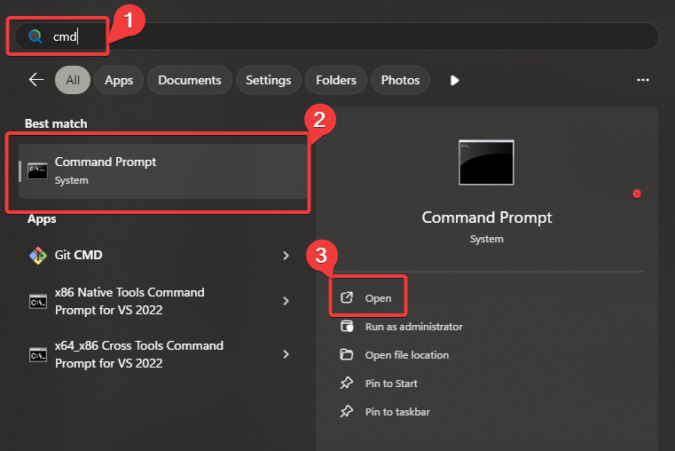
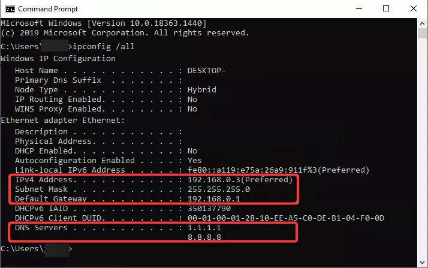
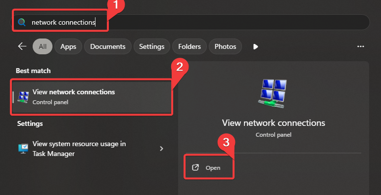
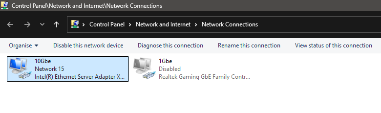
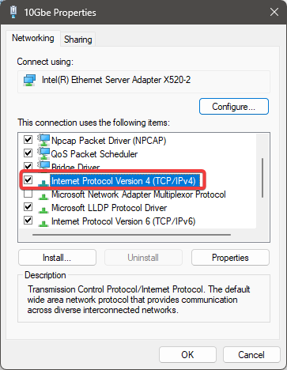
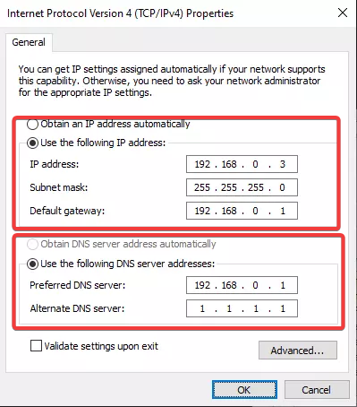

# Redirection de ports

!!! danger " AVERTISSEMENT :"

```
**La redirection de ports comporte des risques.**

En configurant une redirection de ports, vous reconnaissez les risques liés à l’ouverture de ports sur votre réseau domestique et renoncez à engager la responsabilité de BeamMP pour **tout dommage pouvant survenir à vous-même ou à votre foyer**.

Nous déclinons toute responsabilité concernant le contenu des services ou sites web externes vers lesquels ces liens redirigent.

<u>**Si vous ne comprenez pas ce guide, nous vous recommandons d’utiliser l’un de nos partenaires.**</u>
```

!!! warning

```
Vérifiez que votre routeur n’est pas exclusivement compatible avec les connexions 4G/5G. S’il s’agit d’un modèle hybride, veillez à sélectionner l’adaptateur connecté par câble à l’étape 3 de ce guide.
```

## Comment configurer une redirection de ports

La création d’une règle de redirection de ports implique plusieurs notions de réseau. Préparez de quoi prendre quelques notes au fur et à mesure.

Ce guide comporte **4 grandes étapes** :

## Guide rapide

*(Un guide plus détaillé est disponible ci-dessous.)*

<div class="grid cards" markdown>

* :material-dns:{ .lg .middle } **Attribuer une adresse IP statique à votre ordinateur ou à vos appareils**

  ---

  Cette étape est nécessaire pour empêcher l’adresse IP de votre appareil de changer et de rendre la règle de redirection de ports inutilisable.

  [:octicons-arrow-right-24: Consulter les informations concernant votre routeur](https://portforward.com/router.htm#1)

* :material-router-wireless:{ .lg .middle } **Se connecter à votre routeur**

  ---

  Cela se fait généralement en trouvant l’adresse IP de la **passerelle par défaut**, que vous pouvez obtenir en exécutant `ipconfig` dans une invite de commandes, puis en saisissant cette adresse dans la barre d’adresse de votre navigateur.

* :material-lan-connect:{ .lg .middle } **Rediriger les ports vers votre ordinateur**

  ---

  Trouvez la section dédiée à la redirection de ports dans l’interface web de votre routeur. Elle se trouve généralement dans les sections **Network**, **Advanced** ou **LAN**.

* :material-test-tube:{ .lg .middle } **Vérifier que la redirection fonctionne correctement**

  ---

  Utilisez un outil tel que **CheckBeamMP** pour vérifier que votre règle fonctionne.

  <form action="https://check.beammp.com/api/v2/beammp" method="get" target="_blank">
   <label for="ip">Adresse IP :</label>
   <input type="text" id="ip" name="ip"><br>
   <label for="port">Port :</label>
   <input type="text" id="port" name="port"><br>
   <input type="submit" value="CheckBeamMP">
  </form>

</div>

## Guide détaillé

### 1. Attribuer une adresse IP statique

### Méthode 1 : Configurer une adresse IP statique à l’aide d’une réservation DHCP

Une autre méthode pour attribuer une adresse IP statique à votre appareil sur votre réseau local consiste à utiliser la fonction de **réservation DHCP** de votre routeur.

Tous les routeurs ne proposent pas cette fonctionnalité. Recherchez donc le modèle de votre routeur sur Internet afin de consulter son manuel.

Si vous avez réussi à configurer une réservation DHCP, passez directement à [l’étape 2](port-forwarding.md#2-log-in-to-your-router).

### Méthode 2 : Attribuer une adresse IP statique sous Windows

#### 1.1. Trouver votre adresse IP, votre passerelle et vos serveurs DNS actuels

Avant de configurer une adresse IP statique, vous devez connaître les paramètres réseau actuellement utilisés par votre ordinateur.

Notez ces informations quelque part. Pour cette étape, nous allons utiliser l’invite de commandes.

Ouvrez une invite de commandes. Vous pouvez notamment :

* Appuyer sur la touche Windows, puis commencer à saisir `cmd` et appuyer sur Entrée lorsque **« Invite de commandes »** apparaît.

<figure class="image image_resized" style="width:62%;" markdown>

</figure>

Une fois l’invite de commandes ouverte, exécutez la commande suivante :

```text
ipconfig /all
```

Vous verrez alors de nombreuses informations.

Si votre ordinateur possède plusieurs adaptateurs réseau ou des adaptateurs virtuels, la liste peut être encore plus longue. Il est notamment courant d’avoir plusieurs adaptateurs virtuels lorsque **Hyper-V** ou **Docker** est installé.

<figure class="image image_resized" style="width:62%;" markdown>

</figure>

Il est recommandé d’utiliser une connexion réseau filaire pour l’ordinateur qui hébergera le serveur, même si une connexion sans fil fonctionnera également.

Recherchez dans cette liste un adaptateur disposant d’une connexion Internet active. Faites défiler la liste et trouvez celui qui possède une **passerelle par défaut**. De nombreux adaptateurs virtuels n’en possèdent pas.

Voici quelques exemples d’adresses IPv4 locales que vous devriez retrouver sur au moins un des adaptateurs :

* `192.168.x.x`
* `10.x.x.x`
* `172.16.x.x` à `172.31.x.x`

**Masque de sous-réseau** (généralement `255.255.255.0`)
**Passerelle par défaut** (généralement `192.168.0.1` ou `192.168.1.1`)

!!! info "À noter"

```
BeamMP ne prend actuellement pas en charge l’IPv6 pour l’hébergement d’un serveur.
```

#### 1.2. Modifier les paramètres de l’adaptateur

Vous devez maintenant modifier les paramètres de votre adaptateur réseau afin que votre PC conserve la configuration IP qu’il utilise actuellement.

La méthode la plus rapide pour accéder aux paramètres réseau est la suivante :

* Appuyez une fois sur la touche Windows.
* Saisissez **« connexions réseau »** jusqu’à ce que **« Afficher les connexions réseau »** apparaisse.
* Appuyez sur Entrée.

<figure class="image image_resized" style="width:62%;" markdown>

</figure>

Vous devriez voir une liste des connexions réseau disponibles sur votre ordinateur.

Si Hyper-V ou Docker est installé, cette liste peut contenir de nombreux adaptateurs. Recherchez un adaptateur qui **ne porte pas le nom « Hyper-V »**.

<figure class="image image_resized" style="width:62%;" markdown>

</figure>

Faites un clic droit sur votre adaptateur et sélectionnez **Propriétés**. Si **« Protocole Internet version 4 »** n’est pas coché, il ne s’agit probablement pas du bon adaptateur. Essayez-en un autre.

<figure class="image image_resized" style="width:62%;" markdown>

</figure>

Double-cliquez sur **« Protocole Internet version 4 »**. Remplacez **« Obtenir une adresse IP automatiquement »** par **« Utiliser l’adresse IP suivante »**.

Renseignez les champs **Adresse IP**, **Masque de sous-réseau**, **Passerelle par défaut** et **Serveur DNS préféré** avec les informations obtenues précédemment grâce à `ipconfig /all`.

Vous pouvez également utiliser les serveurs DNS de Cloudflare ou de Google :

* **DNS Cloudflare :** `1.1.1.1`, `1.0.0.1`
* **DNS Google :** `8.8.8.8`, `8.8.4.4`

<figure class="image image_resized" style="width:62%;" markdown>

</figure>

Cliquez sur **OK**, puis à nouveau sur **OK**. Votre adaptateur utilise désormais une adresse IP statique au lieu du DHCP.

Ouvrez quelques sites web afin de vérifier que votre connexion Internet fonctionne toujours. Si ce n’est pas le cas, rétablissez **« Obtenir une adresse IP automatiquement »** et essayez l’autre méthode.

### 2. Se connecter à votre routeur

Maintenant que votre appareil dispose d’une adresse IP statique, vous pouvez configurer la redirection de port pour BeamMP.

Commencez par vous connecter à votre routeur. L’un des paramètres que vous avez notés précédemment est la **passerelle par défaut**. Il s’agit de l’adresse IP de votre routeur.

La plupart des routeurs disposent d’une interface web locale permettant de gérer leurs paramètres. Pour y accéder :

* Ouvrez un navigateur web. Firefox, Chrome ou Edge devraient fonctionner.
* Saisissez l’adresse IP de votre passerelle par défaut dans la barre d’adresse, par exemple `192.168.0.1` ou `192.168.1.1`, puis appuyez sur Entrée.

Vous devriez maintenant voir la page de connexion de votre routeur. Tous les routeurs ne nécessitent pas une authentification, mais la plupart en demandent une.

Vous devez connaître le nom d’utilisateur et le mot de passe de votre routeur. Si vous ne vous êtes jamais connecté auparavant, ces identifiants correspondent probablement aux valeurs d’usine par défaut ou sont indiqués sur une étiquette apposée sur le routeur.

Voici quelques identifiants d’usine courants :

| Nom d’utilisateur | Mot de passe |
| ----------------- | ------------ |
| `admin`           | `admin`      |
| `admin`           | `password`   |
| *(vide)*          | `admin`      |
| *(vide)*          | `password`   |

Essayez différentes combinaisons avec `admin`, `password` ou en laissant les champs vides. *Lorsque « vide » est indiqué, laissez simplement le champ concerné vide.*

### 3. Créer les règles de redirection

#### 3.1. Trouver la section dédiée à la redirection

Trouvez la section consacrée à la redirection de ports dans l’interface web de votre routeur.

Parcourez les différents onglets ou liens situés en haut ou à gauche des pages de configuration. La section de redirection de ports se trouve généralement sous **Network**, **Advanced** ou **LAN**.

Les termes suivants peuvent vous aider à la trouver :

* **Port Forwarding**
* **Forwarding**
* **Port Range Forwarding**
* **Virtual Servers**
* **Apps & Gaming**
* **Advanced Setup/Settings**
* **NAT**

#### 3.2. Renseigner les informations

Une fois la section de redirection de ports trouvée, vous pouvez saisir les informations nécessaires.

Votre routeur doit vous permettre d’indiquer les ports à rediriger ainsi que l’adresse IP de destination vers laquelle le trafic doit être envoyé.

Si votre routeur distingue les **ports internes** et **externes**, utilisez le même numéro pour les deux.

BeamMP utilise par défaut le port **30814** en **TCP et UDP**, sauf si vous avez modifié ce paramètre dans votre [fichier `ServerConfig.toml`](create-a-server.md#4-configuration).

!!! info "À noter"

```
Le port par défaut est **30814**, mais vous pouvez choisir n’importe quel autre port compris entre `1025` et `65534`.

Si vous choisissez un autre port, notez-le soigneusement. Vous devez également rediriger ce port en **TCP et en UDP**.

Il est recommandé de conserver le port par défaut, car il est très peu probable qu’un autre service de votre PC l’utilise.

Si vous hébergez plusieurs serveurs sur la même machine, chaque serveur doit utiliser un port différent. Par exemple : serveur 1 sur `30814`, serveur 2 sur `30815`, etc.
```

Certains routeurs nécessitent la création de deux règles distinctes, une pour **UDP** et une pour **TCP**. D’autres permettent de sélectionner les deux protocoles dans une seule règle.

La plupart des routeurs disposent d’un bouton **Enregistrer**, et certains nécessitent un redémarrage pour appliquer les modifications.

### 4. Tester la connexion

Il existe plusieurs façons de tester votre connexion.

Nous vous recommandons d’utiliser notre outil **CheckBeamMP**, car il vérifie spécifiquement les protocoles et les problèmes liés à BeamMP.

<form action="https://check.beammp.com/api/v2/beammp" method="get" target="_blank">
  <label for="ip">Adresse IP :</label>
  <input type="text" id="ip" name="ip"><br>
  <label for="port">Port :</label>
  <input type="text" id="port" name="port"><br>
  <input type="submit" value="CheckBeamMP">
</form>

Vous devez renseigner votre **adresse IPv4 publique**. Il existe plusieurs façons de la trouver, notamment en utilisant [whatsmyip.org](https://whatsmyip.org/), un site qui affiche votre adresse IP publique.

Recherchez une adresse au format :

`xxx.xxx.xxx.xxx`

Vous pouvez ensuite utiliser le lien suivant en remplaçant `IP` par votre adresse IPv4 publique et `port` par le port de votre serveur. Veillez à ne laisser aucun espace :

[https://check.beammp.com/api/v2/beammp/ip/port](https://check.beammp.com/api/v2/beammp/ip/port)

!!! success "status: ok"

```
Si vous obtenez le résultat ci-dessus, vous pouvez désormais rejoindre votre serveur.

Il existe deux façons de vous connecter : directement avec les informations que vous avez saisies dans CheckBeamMP ou, si votre serveur est configuré comme public, via la liste des serveurs.

Comme vous hébergez le serveur sur votre propre réseau, utilisez `127.0.0.1` (*localhost*) si le serveur est exécuté sur le même PC que celui sur lequel vous jouez. Sinon, utilisez l’adresse IPv4 locale de la machine qui héberge le serveur.
```

!!! failure "status: error"

```
Si la connexion échoue complètement, votre fournisseur d’accès à Internet utilise peut-être un **CGNAT (Carrier-Grade Network Address Translation)**.

Pour plus d’informations, consultez [« Comment vérifier si vous êtes derrière un CGNAT ? »](../FAQ/How-to-check-for-CGNAT.md).

Vous pouvez également ouvrir un **ticket d’assistance serveur** sur notre [serveur Discord](https://discord.gg/beammp), dans le canal `#support`. Un membre de notre équipe pourra alors vous aider.

Si seul le TCP fonctionne tandis que l’UDP échoue, vérifiez à nouveau les règles de votre pare-feu et de redirection de ports.
```
