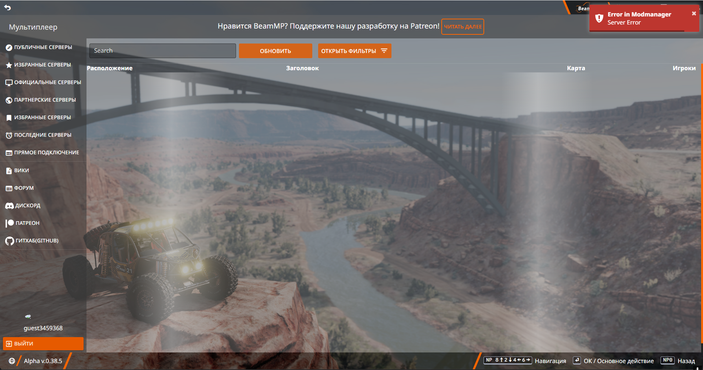

!!! warning "Этот сайт находится в стадии разработки!"

```
Над этим сайтом, как и страницей ведется активная работа.

Чувствуете, что можете помочь? Пожалуйста, сделайте это, нажав на страницу с карандашом справа!

Это можно сделать на любой странице.
```

!!! warning "Данное FAQ не затрагивает технический аспект использования програм обхода DPI, поскольку мы не одобряем обход блокировок вашим регулятором! Так-же, мы не будем рассказывать вам о том, как настроить свой сервер для принятия VPN соединений, вам будет предоставлена рекомендация по протоколам, и настройки на стороне клиента, не сервера!"

Недоступность сервиса BeamMP

## Проблема

Вы заметили, что не можете посетить [наш сайт](https://beammp.com) , не можете подключиться на некоторые сервера, или просто страница браузера грузится очень долго.

# Как проверить наличие ошибок на вашей стороне?

Первое что вам понадобиться, убедиться что проблема на вашей стороне.

Рекомендуется проверка `tracert -4 beammp.com` и/или `ping beammp.com`

 

На данный момент, мы убеждены, что мы не виновники отсутвия соединения до [BeamMP](https://beammp.com), и можем продолжать далее

## Проверка веб страницы, лаунчера игры, авторизации

# Проверка веб страницы

Поскольку `tracert` и `ping` дали нам положительный результат с соединением сервера, требуется проверить загрузку веб-страницы [BeamMP](https://beammp.com)

Мы будем проверять сразу с открытым `DevTools(F12) -> вкладка "Network"` , поскольку результат может различаться в некторой степени


Если ваш результат загрузки страницы равен тому, что ваш браузер "условно" загрузил страницу, вы подвержены ограничению, если иного уведомления от Команды BeamMP не поступило!

Переходите к содержанию `Рекомендации по выбору протокола`

# Проверка лаунчера


На момент создания данного FAQ, у меня не получилось воспроизвести проблему...
...


Переходите к содержанию `Рекомендации по выбору протокола`

# Проверка авторизации

На момент создания данного FAQ, у меня не получилось воспроизвести проблему, но мы имеем ситуацию когда backend запрашивается но не можем получить результат списка серверов
...





Переходите к содержанию `Рекомендации по выбору протокола`

## Рекомендации по выбору протокола

...

Переходите к содержанию `Рекомендации по выбору протокола`

## Возможные ошибки при использовании VPN

...
