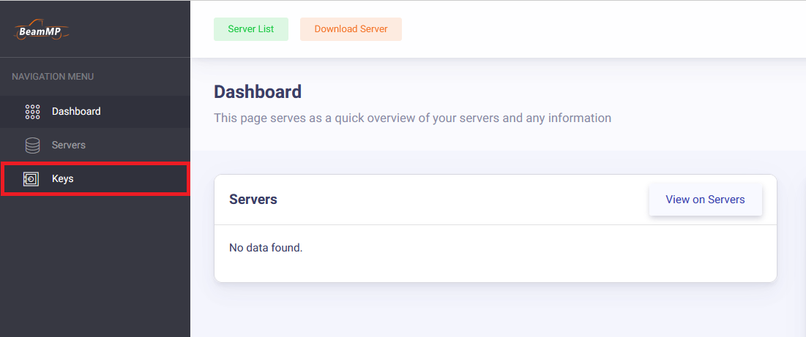
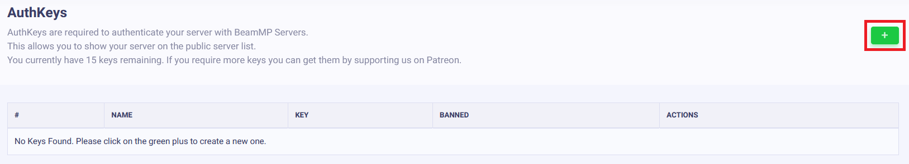
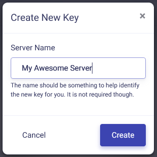
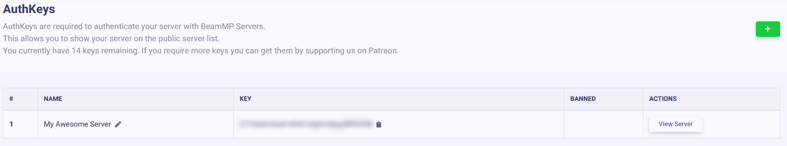
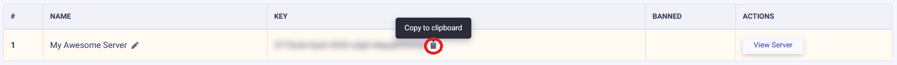
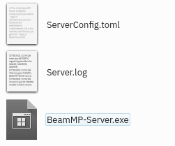

# Установка Сервера

## **Создание Сервера**

Основы настройки серверного приложения

---

### **Обзор**

**Создание домашнего сервера бесплатно, размещение его на VPS проще и безопаснее**

Серверы являются неотъемлемой частью BeamMP; игроки подключаются друг к другу через сервер. Они работают нативно на Windows и Linux.

Вы можете создавать частные серверы, к которым смогут присоединиться только приглашенные вами люди, или публичные серверы, которые будут отображаться в нашем официальном списке серверов.

Запуск сервера — это процесс из нескольких шагов! Если у вас возникнут какие-либо проблемы, смело задавайте их на нашем [форуме](https://forum.beammp.com) или на нашем [сервере Discord](https://discord.gg/beammp) в канале `#support`. Также обратитесь к разделу [«Обслуживание сервера»](server-maintenance.md) для получения дополнительной информации.

Перед использованием обязательно прочтите [ЛИЦЕНЗИЮ](https://raw.githubusercontent.com/BeamMP/BeamMP-Server/master/LICENSE) сервера.

Примечание: *сервер поддерживает только IPv4. Если вы не знаете, какой у вас IPv4, посмотрите на IP-адрес, который вы видите на [*whatsmyip.org*](https://www.whatsmyip.org/) — если он содержит* двоеточия `_:_` *, это **IPv6**. В этом случае вам следует дополнительно выяснить, есть ли у вас IPv4. Вы можете позвонить своему интернет-провайдеру, чтобы узнать это, или спросить кого-то, кто живет с вами (если они разбираются в технологиях, они могут знать!). Поддержка IPv6 планируется.*

## Настройка Сервера

Настройка состоит из следующих шагов, вам следует выполнить их все.

### **1. Переадресация портов**

!!! информация

```
If you are on a VPS (Virtual Private Server), Rootserver, or plan on hosting this server locally (with players in the same house as you), you can skip this step.
This step is necessary if you want someone **outside** of your household to join your home-hosted server (outside of your local network).

!!! danger ":material-scale-balance: DISCLAIMER:"

    **Port forwarding is a risk**.

    By port forwarding, you understand the risks of opening up ports on your home network to the public and therefore void the right to hold BeamMP accountable for **any and all** damages that may happen to you or your household.

    We take no responsibility for any content on any externally linked services or websites.

It is therefore recommended to host a server with one of our partnered services!

*Please see [this guide on how to port forward](port-forwarding.md)*
```

#### Партнерские услуги хостинга (платные):

- [Хостинг Горизонта](https://hrzn.link/beammp)
- [RackGenius](https://rackgeni.us/beammp-plans)
- [Подключить хостинг](https://connecthosting.net/beammp)
- [Хостинг Assetto](https://assettohosting.com/en/games/beamng)
- [ZAP-Хостинг](https://zap-hosting.com/itsbeammp)
- [HostHavoc](https://hosthavoc.com/)
- [PedalHost](https://pedal.host/)
- [Хостинг Vyper](https://vyperhosting.com/r/beammp)
- [BisectHosting](https://www.bisecthosting.com/beammp-server-hosting)
- [Хостинг Four Seasons](https://fourseasonshosting.com)
- [Vertuo Хостинг](https://vertuohosting.com)
- [Winheberg](https://winheberg.fr/offres/gaming/beammp?lang=en)
- [Ваббанод](https://wabbanode.com/partner/beammp)
- [Айcлайн Хостинг](https://iceline-hosting.com/games/beammp)

#### 1.1 Брандмауэр

В зависимости от настроек вам может потребоваться разрешить BeamMP-Server проходить через ваш брандмауэр. Это касается Windows (отключение брандмауэра обычно **не** работает) и многих предустановленных серверов Linux.

Там вы хотите разрешить BeamMP-Server через брандмауэр, **как входящие, так и исходящие соединения**, и **как TCP, так и UDP**. Если ваш брандмауэр запрашивает порт вместо этого, это должен быть тот же порт, который вы использовали на шаге «1. Переадресация портов» (обычно 30814).

Для более детализированного руководства, обратитесь к [этой странице документации](https://docs.beammp.com/FAQ/Defender-exclusions/). Если у вас остались проблемы, вы можете спросить о них на [Форуме](https://forum.beammp.com) или нашем [Discord сервере](https://discord.gg/beammp) в `#support` канале.

### **2. Получение ключа аутентификации**

«Ключ аутентификации», часто называемый «AuthKey», необходим для того, чтобы сделать **общедоступный** сервер доступным для списка серверов. Хотя рекомендуется добавлять authkey и к частным серверам. У вас есть ограниченное количество ключей. Один ключ может использоваться на одном сервере одновременно, поэтому вы не можете запустить два сервера одновременно с одним и тем же ключом. Дополнительные ключи можно получить, поддержав проект. Прочитайте [эту статью](https://docs.beammp.com/support/player-faq/) для получения дополнительной информации.

!!! предупреждение

```
НИКОГДА НЕ ДЕЛИТЕСЬ ЭТИМ КЛЮЧОМ И НЕ ПОКАЗЫВАЙТЕ ЕГО НИКОМУ. ОТНОСИТЕСЬ К НЕМУ КАК К ПАРОЛЮ.
```

Для этого шага вам понадобится учетная запись [Discord](https://discord.com). Это необходимо для предотвращения спама.

#### 2.1. Доступ к странице ключей

Войдите в [Keymaster](https://beammp.com/keymaster) через Discord. На домашней странице Keymaster нажмите «Ключи» в левой части экрана:


<figure markdown=""></figure>

#### 2.2 Создание ключа

Чтобы создать свой ключ, нажмите на зеленую кнопку «+» в правом верхнем углу.


<figure markdown=""></figure>

#### 2.3. Заполнение ключевой информации

Далее заполните поле Имя сервера (это просто имя ключа, а не фактическое имя сервера в списке), затем нажмите «Создать». Пример:


<figure class="image image_resized" style="width:44.84%;" markdown=""></figure>

В конечном итоге это должно выглядеть примерно так:


<figure markdown=""></figure>

#### 2.4 Копирование ключа

Теперь скопируйте текст в поле «Ключ», в этом примере это `3173a2e-6az0-4542-a3p0-ddqq5ff95558` и сохраните его для следующего шага. Вы можете сделать это, щелкнув по буферу обмена справа от ключа:


<figure markdown=""></figure>

### **3. Установка**

BeamMP-Server доступен для Windows и Linux. Следующие два раздела посвящены Windows и Linux.

#### 3.а. Установка на Windows

Для установки Linux см. следующий шаг.

Пожалуйста, убедитесь, что у вас перенаправлены порты, прежде чем пытаться разместить сервер дома! Без перенаправления портов вы не сможете разместить сервер для общественности!

1. Для запуска сервера убедитесь, что у вас установлены [Visual C++ Redistributables](https://aka.ms/vs/17/release/vc_redist.x64.exe).
2. Загрузите исполняемый файл сервера с [beammp.com](https://www.beammp.com/). У вас должен получиться исполняемый файл, который называется примерно так: `BeamMP-Server.exe`.
3. После загрузки создайте где-нибудь папку и поместите туда `BeamMP-Server.exe`. Это то место, где будет находиться ваш сервер.
4. Запустите сервер один раз, дважды щелкнув по нему. Это сгенерирует все необходимые файлы для вас, как только вы увидите текст, вы можете закрыть его и перейти к следующему шагу. Вы должны увидеть файл `ServerConfig.toml` рядом с вашим `BeamMP-Server.exe`.
5. (необязательно) Для быстрого доступа в будущем вы можете легко создать ярлык на рабочем столе для `BeamMP-Server.exe` используя **[Щелкните правой кнопкой мыши]** &gt; **Отправить на** &gt; **Рабочий стол (создать ярлык).**

Теперь перейдите к шагу [4. Конфигурация](#4-configuration).

#### 3.б. Установка на Linux

##### Использование нашей сборки (рекомендуется)

Этот шаг будет работать на всех дистрибутивах, для которых мы предоставляем [здесь](https://github.com/BeamMP/BeamMP-Server/releases/latest) файлы. Если у вас другой дистрибутив или архитектура, обратитесь к шагу «Сборка из исходного кода» ниже.

1. Убедитесь, что у вас установлены зависимости, перечисленные [здесь](https://github.com/BeamMP/BeamMP-Server#runtime-dependencies).
2. Перейдите на сайт [beammp.com](https://beammp.com/) и нажмите кнопку «Загрузить сервер», вы будете перенаправлены на страницу релиза сервера на GitHub.
3. Загрузите правильную версию для вашего дистрибутива. Для простоты с этого момента она будет называться `BeamMP-Server-xxx`, где `xxx` обозначает версию для используемого вами дистрибутива.
4. После загрузки вы должны увидеть один файл с именем `BeamMP-Server-xxx`, среди прочих, которые вы можете пока проигнорировать. Создайте где-нибудь папку и поместите туда `BeamMP-Server-xxx`. Это то место, где будет находиться ваш сервер.
5. Откройте терминал, перейдите в папку, в которую вы поместили `BeamMP-Server-xxx`, и выполните `chmod +x BeamMP-Server-xxx`. Это гарантирует, что у вас есть разрешения на его запуск.
6. Запустите сервер один раз, запустив его с помощью `./BeamMP-Server-xxx`. Это сгенерирует все необходимые файлы для вас, как только вы увидите текст, вы можете закрыть его и перейти к следующему шагу. Вы должны увидеть файл `ServerConfig.toml` рядом с вашим `BeamMP-Server-xxx`.
7. (необязательно) Настоятельно рекомендуется настроить пользователя с именем `beammpserver` (или похожим), поскольку мы НЕ рекомендуем запускать сервер как root, sudo или с вашей личной учетной записью пользователя. Затем вам следует предпринять шаги, чтобы убедиться, что вы запускаете сервер только как этот пользователь.

Теперь перейдите к шагу «4. Конфигурация».

##### Сборка из источника

Другие дистрибутивы в дополнение к тем, которые уже имеют [здесь](https://github.com/BeamMP/BeamMP-Server/releases/latest) двоичный файл, вероятно, тоже будут работать, но официально не поддерживаются. Если вы хотите собрать его самостоятельно, вы можете сделать это, загрузив исходный код на нашем [GitHub](https://github.com/BeamMP/BeamMP-Server), руководство можно найти [здесь](https://github.com/BeamMP/BeamMP-Server#build-instructions).

В конце обязательно запустите свой сервер один раз с помощью `./BeamMP-Server`, а затем переходите к следующему шагу.

### **4. Конфигурация**

Теперь, когда вы запустили сервер один раз, он должен был создать некоторые файлы и, вероятно, выдать одну или две ошибки. Это потому, что мы еще не закончили. В вашей папке должны быть эти файлы:


<figure markdown=""></figure>

Они называются «ServerConfig.toml», «Server.log» и «BeamMP-Server.exe»! (В зависимости от ваших настроек вы можете не увидеть расширения [.toml] [.log] [.exe])

Откройте `ServerConfig.toml` с помощью текстового редактора, например `Notepad`. Это можно сделать с помощью [Правый клик] → «Открыть с помощью…» и выбора текстового редактора.

Вот пример конфигурации:

```TOML
[General]
Port = 30814
AuthKey = "auth-key"
AllowGuests = false
LogChat = false
Debug = false
IP = "::"
Private = true
InformationPacket = true
Name = "Test Server"
Tags = "Freeroam,Modded,Racing,Police"
MaxCars = 2
MaxPlayers = 10
Map = "/levels/ks_nord/info.json"
Description = "Total Random Beam MP Server"
ResourceFolder = "Resources"
```

!!! информация

```
  Это ваш файл конфигурации. Он использует формат TOML. Дополнительную информацию об этом файле и переменных см. в разделе [Обслуживание сервера](server-maintenance.md).
  Ваш сервер **НЕ** будет отображаться в списке серверов, пока установлено значение `Private = true`. _Если_ вы хотите, чтобы он отображался в списке, установите значение **`Private = false`**.
```

Пока что нас интересует только поле `AuthKey`. В кавычки `"` нужно вставить свой AuthKey, скопированный на первом шаге.

Для нашего примера ключ должен выглядеть следующим образом:

```TOML
AuthKey = '3173a2e-6az0-4542-a3p0-ddqq5ff95558'
```

Присвойте своему серверу имя в поле `Name`. Вы можете форматировать его с помощью цветов и других средств; подробности см. в [этом разделе о настройке имени](server-maintenance.md#customize-the-look-of-your-server-name) на странице обслуживания сервера.

Если вы выбрали другой **порт**, отличный от **30814**, обязательно замените его здесь в разделе `Port`.

### **5. Проверка**

Теперь снова запустите сервер и посмотрите, выдает ли он еще сообщения `[ERROR]` или `[WARN]`. Теперь сервер должен оставаться открытым. В следующих шагах (6.) ниже вы можете узнать, как присоединиться к серверу.

---

#### 5.1 Как добавить моды на свой сервер

Моды транспортных средств и моды карт устанавливаются по-разному, но оба требуют, чтобы вы поместили их в папку вашего сервера (`Resources/Client`). Просто перетащите любой мод, который вы хотите добавить, в эту папку.

!!! warning

```
Should you receive a "done" or "start" message when trying to join your server after adding mods, you likely added an incompatible or broken mod to your server.
Mod incompatibilities can also occur between 2 or more mods. If you have client mods installed, check [this guide](../../FAQ/How-to-deactivate-mods.md) about removing mods from your game.
```

#### 5.2 Общие моды

Если вы хотите добавить только модифицированные транспортные средства, вы можете поместить zip-файл мода в папку `Resources/Client`. Они будут автоматически загружены любым, кто присоединится к вашему серверу.

#### 5.3 Карты

Все стандартные карты (карты, которые не являются модами) работают сразу «из коробки» и не требуют установки. Вам нужно лишь изменить параметр `Map` в файле `ServerConfig.toml` на любое из [этих](server-maintenance.md#all-vanilla-maps-names). Для любых других, модифицированных карт, сделайте следующее:

1. Поместите `.zip`-файл вашей карты в папку вашего сервера (`Resources/Client`).
2. Далее, загляните в zip-файл карты (не извлекайте его) и откройте папку `levels`. В этой папке должна быть просто еще одна папка с названием карты, например, «myawesomedriftmap2021». Обязательно скопируйте или запомните это название *точно так, как оно написано в названии этой папки.*
3. Откройте `ServerConfig.toml`. В настройках `Map` вы должны увидеть `/levels/MAPNAME/info.json`, где `MAPNAME`, скорее всего, что-то вроде `gridmap_v2`. Теперь вам нужно заменить `MAPNAME` на имя папки из последнего шага, в том примере это было `myawesomedriftmap2021`. В итоге это должно выглядеть так (для этого примера) и ***должно*** иметь `/info.json` в конце.

```TOML
Map = '/levels/myawesomedriftmap2021/info.json'
```

Теперь, когда кто-то присоединится к вашему серверу, он должен автоматически загрузить карту и работать так, как и ожидалось.

**Если это НЕ работает**, установите карту в одиночную игру BeamNG.drive, запустите ее и войдите в карту. Затем откройте консоль, нажав клавишу `~` (*тильда*) (если у вас не американская раскладка клавиатуры, посмотрите на действие **Toggle System Console** в меню **Options &gt; Controls &gt; Bindings** в разделе **General Debug**), и запустите `print(getMissionFilename())`. Это должно показать вам имя для использования.

Вот и все! Ваша модифицированная карта теперь должна быть доступна для присоединения!

### **6. Как присоединиться к вашему серверу**

Как вы и другие игроки можете присоединиться к вашему серверу.

#### 6.a. Присоединение к собственному серверу (как частному, так и публичному)

Если ваш сервер размещен на том же ПК, на котором работает игра, вы должны присоединиться к серверу с помощью прямого подключения, для этого нажмите **вкладку Direct Connect** слева от списка серверов. Оставьте там информацию по умолчанию (должно быть 127.0.0.1 и соответствующий порт), затем нажмите Connect.

Если ваш сервер размещен на другом ПК в вашей локальной сети, вам необходимо найти локальный IP-адрес этой машины и напрямую подключиться, используя этот локальный IP-адрес.

Если ваш сервер размещен за пределами вашего дома (например, VPS), вам необходимо найти [публичный IP-адрес](https://whatismyipaddress.com/) этой машины и подключиться напрямую через него.

#### 6.б. Присоединение других людей к вашему приватному серверу

Вам необходимо предоставить другим пользователям публичный IP-адрес вашего сервера. Однако будьте осторожны, сообщая свой публичный IP-адрес незнакомцам! Чтобы присоединиться к вашему частному серверу, игроки должны перейти на **вкладку Direct Connect** в BeamMP, затем ввести свой IP и порт.

#### 6.c. Присоединение других людей к вашему публичному серверу

Чтобы присоединиться к вашему публичному серверу, они могут просто перейти к списку серверов, ввести имя сервера и нажать «подключиться». Если вы не уверены в имени своего сервера, это будет имя, которое вы указали в `ServerConfig.toml`. Убедитесь, что фильтры поиска отключены, а Карта установлена на «Любая», если вы не можете ее найти. Вы также можете проверить веб-сайт [Keymaster](https://beammp.com/keymaster) на предмет IP-адреса сервера.

Если вы или ваши друзья столкнулись с ошибкой «Сбой подключения!», проверьте окно запуска на наличие кодов вроде 10060, 10061, 10030. Это означает, что у вас либо есть CGNAT IPv4, либо вы сделали что-то неправильно на шаге **1 Переадресация портов** или **1.1. Межсетевой экран**. Чтобы проверить, есть ли у вас CGNAT IPv4, найдите WAN IP-адрес на интерфейсе маршрутизатора. Сравните его с вашим [публичным IP-адресом](https://www.whatsmyip.org/). Если они одинаковы, вы не находитесь за CGNAT. Поддержка IPv6 пока **НЕ** реализована.

### **7. Как проверить подключение вашего сервера BeamMP**

Введите публичный IPv4-адрес и порт сервера ниже, затем нажмите «CheckBeamMP».

<form action="https://check.beammp.com/api/v2/beammp" method="get" target="_blank">
  <label for="ip">IP-адрес:</label>
  <input type="text" id="ip" name="ip"><br>
  <label for="port">Порт:</label>
  <input type="text" id="port" name="port"><br>
  <input type="submit" value="CheckBeamMP">
</form>

!!! предупреждение «Я хочу использовать VPN, например RadminVPN, Hamachi или аналогичный».

```
BeamMP не поддерживает эти VPN, так как они часто вызывают проблемы. Одна из этих проблем — непереадресация трафика UDP. Чтобы решить эту проблему, обратитесь к разделу 1.

!!! вопрос «Но почему это работало в прошлом?»

Это происходит из-за того, что разработчики этих приложений обновляют свое программное обеспечение и вносят изменения, которые BeamMP не контролирует.
Разработчики этих приложений должны обеспечить поддержку конкретных вариантов использования, таких как BeamMP-Server.
```

## Все еще сталкиваетесь с проблемами?

Откройте тему на [форуме](https://forum.beammp.com) или на нашем [сервере Discord](https://discord.gg/beammp) в канале `#support`.
