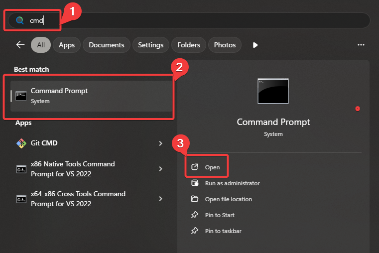
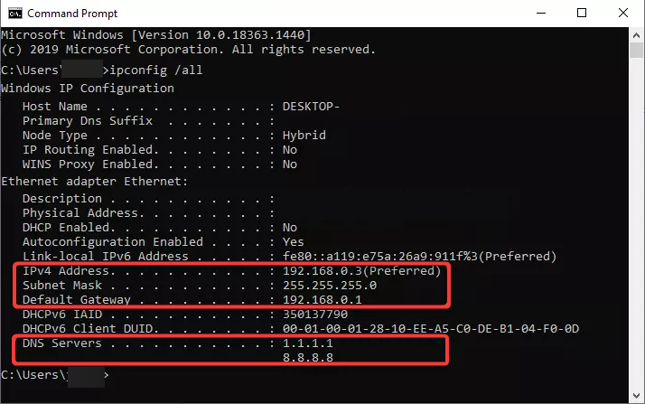
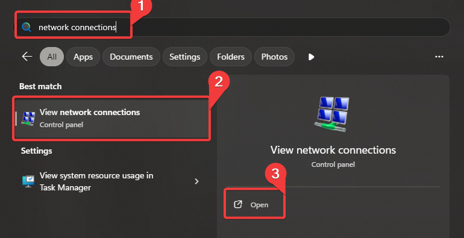
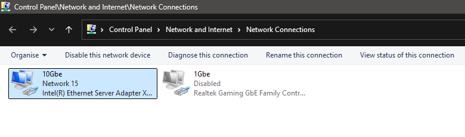
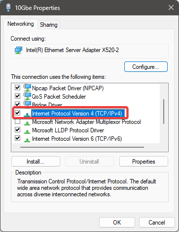
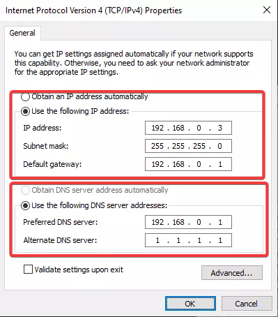

# 端口转发

!!! 风险 ":material-scale-balance: 免责声明："

```
“端口转发存在风险”。

通过端口转发，你理解将家庭网络端口向公众开放的风险，因此无权追究 BeamMP 对你或你家庭可能发生的 任何 损害负责。

我们对任何外部链接服务或网站上的内容不承担任何责任。

<u>如果你不理解本指南，请考虑使用我们的合作伙伴提供的服务。</u>
```

!!! 警告

```
请确保你的路由器不是仅支持 4G/5G 的设备。如果是混合设备，请在本指南第 3 节中选择有线连接的适配器！
```

## 怎么设置端口转发

创建端口转发规则涉及一些详细的网络术语。在操作过程中，请准备记录一些笔记。

本指南共有 4 个主要步骤。

## 快速指南（更详细的指南见下文）

<div class="grid cards" markdown>
</div>
<ul data-md-type="list" data-md-list-type="unordered" data-md-list-tight="false">
<li data-md-type="list_item" data-md-list-type="unordered">
<p data-md-type="paragraph">:material-dns:{ .lg .middle } <strong data-md-type="double_emphasis">为你的电脑或设备分配一个静态 IP 地址</strong></p>
<hr data-md-type="hrule">
<p data-md-type="paragraph">这是为了防止你的设备 IP 发生变化，从而导致端口转发规则失效。</p>
<p data-md-type="paragraph"><a href="https://portforward.com/router.htm#1" data-md-type="link">:octicons-arrow-right-24: 查看你的路由器信息</a></p>
</li>
<li data-md-type="list_item" data-md-list-type="unordered">
<p data-md-type="paragraph">:material-router-wireless:{ .lg .middle } <strong data-md-type="double_emphasis">登录你的路由器</strong></p>
<hr data-md-type="hrule">
<p data-md-type="paragraph">通常可以通过查找‘默认网关’IP 来完成，此 IP 可在命令提示符执行 <code data-md-type="codespan">ipconfig</code> 时找到，然后将其输入浏览器地址栏。</p>
</li>
<li data-md-type="list_item" data-md-list-type="unordered">
<p data-md-type="paragraph">:material-lan-connect:{ .lg .middle } <strong data-md-type="double_emphasis">将端口转发到你的电脑</strong></p>
<hr data-md-type="hrule">
<p data-md-type="paragraph">在路由器的网页界面中找到端口转发部分。大多数路由器会将端口转发部分列在网络（Network）、高级（Advanced）或局域网（LAN）下。</p>
</li>
<li data-md-type="list_item" data-md-list-type="unordered">
<p data-md-type="paragraph">:material-test-tube:{ .lg .middle } <strong data-md-type="double_emphasis">测试端口是否已正确转发</strong></p>
<hr data-md-type="hrule">
<p data-md-type="paragraph">使用像 CheckBeamMP 这样的工具测试规则是否生效。</p>
<div data-md-type="block_html">
<form action="https://check.beammp.com/api/v2/beammp" method="get" target="_blank">
 <label for="ip">IP address:</label>
 <input type="text" id="ip" name="ip"><br>
 <label for="port">端口:</label>
 <input type="text" id="port" name="port"><br>
 <input type="submit" value="CheckBeamMP">
</form>
</div>
</li>
</ul>
<div data-md-type="block_html"></div>

## 详细指南

### 1. 分配静态 IP 地址

### 方法 1：通过 DHCP 保留设置静态 IP 地址

在本地网络中设置静态 IP 地址的另一种方法是使用路由器的 DHCP 保留功能。并非所有路由器都具备此功能，因此这可能不适用于你。请使用你的路由器型号在网上搜索使用手册。

如果你已经完成此操作，请直接跳到 [第 2 步](port-forwarding.md#2-log-in-to-your-router)。

### 方法 2：在 Windows 中分配静态 IP 地址

#### 1.1. 查找您当前的IP地址、网关和DNS服务器：

在设置静态IP地址之前，我们需要先了解您当前的网络设置。您可能需要记下这些信息，因此请提前打开记事本窗口备用。这一步我们将使用命令提示符进行操作。

打开命令提示符。主要有以下三种方式：

- 按下Windows键，然后输入“cmd”，当看到“命令提示符”高亮显示时按Enter键。

<figure class="image image_resized" style="width:62%;" markdown="">  </figure>

一旦您进入了命令提示符，运行以下命令：

```
ipconfig /all
```

你会看到大量数据。如果你有虚拟或多个网络适配器，那么你会看到更多数据。如果安装了 Hyper-V 或 Docker，通常会出现许多虚拟适配器。

<figure class="image image_resized" style="width:62%;" markdown="">  </figure>

建议使用有线网络连接来运行此服务器，但无线连接也可正常工作。您需要在此列表中寻找具有活跃互联网连接的适配器。滚动列表并找到已分配默认网关的适配器，许多虚拟适配器通常没有默认网关。

以下是本地IPv4地址示例，至少有一个适配器应具备这些地址。您需要记下适配器的信息。

- 192.168.x.x
- 10.x.x.x.
- 172.16.x.x - 172.31.x.x

子网掩码（常见取值为255.255.255.0）  <br>默认路由地址（典型配置为192.168.0.1或192.168.1.1）

!!! info "请注意" BeamMP 目前不支持使用 IPv6 协议托管服务器。

#### 1.2. 修改适配器设置

现在我们需要更改网络适配器的设置，以便您的计算机能够维持当前分配的IP配置。访问网络设置的最快捷途径是：

- 单击Windows键
- 输入“网络连接”，直到您看到“查看网络连接”。
- 按下回车键

<figure class="image image_resized" style="width:62%;" markdown="">  </figure>

你会看到电脑上的网络连接列表。如果你安装了 Hyper-V 或 Docker，可能会有很多适配器。请寻找任何不命名为 "Hyper-V" 的适配器。

<figure class="image image_resized" style="width:62%;" markdown="">  </figure>

右键点击您的适配器并选择属性。如果`互联网协议版本4`未被勾选，则表明此适配器选择有误，请更换其他适配器。

<figure class="image image_resized" style="width:62%;" markdown="">  </figure>

双击`互联网协议版本4`。将`自动获取IP地址`更改为`使用以下IP地址`。

使用命令提示符（ipconfig /all）中的信息填写IP地址、子网掩码、默认网关和首选DNS服务器。

或者，您也可以不使用当前DNS服务器，而选择CloudFlare或Google提供的DNS服务器：

- CloudFlare DNS: 1.1.1.1, 1.0.0.1
- Google DNS: 8.8.8.8, 8.8.4.4

<figure class="image image_resized" style="width:62%;" markdown="">  </figure>

点击确定，然后再次点击确定，您的适配器现在已从DHCP更改为静态IP配置。请上网浏览以确认是否仍然保持互联网连接。如果无法连接，请将设置改回自动获取IP地址，并尝试下一种方法。

### 2. 登录您的路由器

既然您的设备已设置静态IP地址，现在可以开始为BeamMP配置端口转发。

首先，我们需要登录到您的路由器。之前您记录下来的设置中包括默认网关，该地址即为您路由器的IP地址。

大多数路由器通过本地网页界面进行管理。要访问路由器的管理菜单和设置：

- 打开一个浏览器，Firefox, Chrome 或 Edge应该都可以正常工作
- 在地址栏中，输入您的默认网关IP地址，例如 192.168.0.1 或 192.168.1.1，然后按回车键。

现在您应该能看到路由器的登录界面。并非所有路由器都需要登录，但大多数都需要。您需要知道路由器的用户名和密码。如果是首次登录，用户名和密码很可能仍为出厂默认值，或者在某些情况下会印在路由器的贴纸标签上。

以下是部分最常见的出厂默认用户名与密码列表：

用户名 | 密码
--- | ---
admin | admin
admin | password
{blank} | admin
{blank} | password

尝试使用admin、password等不同组合，或直接留空输入框。*若提示留空，请尝试不填写任何内容。*

### 3. 创建转发规则

#### 3.1. 查找端口转发设置的地方

在路由器网页界面中找到端口转发设置区域。请通过点击页面顶部或左侧的选项卡或链接来浏览路由器菜单。大多数路由器会将端口转发功能列在"网络"、"高级"或"局域网"等分类下。留意查找以下关键词来定位该功能：

- 端口转发
- 转发
- 端口范围转发
- 虚拟服务器
- 应用程序 &amp; 游戏
- 高级配置/设置
- NAT

#### 3.2. 填写详细信息

找到路由器的端口转发设置后，即可开始输入必要信息。路由器会提供输入区域用于填写需要转发的端口号以及对应的目标IP地址。若路由器同时显示内部端口和外部端口选项，请确保填写相同的端口号以保持一致。

BeamMP 需要同时开放 UDP 和 TCP 协议的 30814 端口（除非您已在 [ServerConfig.toml](create-a-server.md#4-configuration) 配置文件中修改过此端口）。

!!! info "注意"  <br>虽然默认端口为 **30814**，您也可以选择1024至65535之间的其他端口号（若使用非默认端口需自行记录）。需要同时转发 **TCP** 和 **UDP** 协议。  <br>建议保持使用默认端口，因此端口被本机其他服务占用的可能性极低。若需在同一台机器上部署多个服务器，则每个服务器需使用不同端口（例如：服务器1使用30814，服务器2使用30815）。

在某些路由器中，您可能需要创建两条规则（一条用于UDP，另一条用于TCP），而有些路由器则更便捷，允许您通过单条规则同时设置两种协议！

绝大多数路由器都设有“保存”按钮，而部分机型在更改生效前还需重启或复位系统。

### 4. 测试一下！

连接测试可通过以下几种不同方式进行。

我们推荐的方式是使用我们的工具 **CheckBeamMP**，因为它能够检测BeamMP特有的问题和协议。

<form action="https://check.beammp.com/api/v2/beammp" method="get" target="_blank">
  <label for="ip">IP address:</label>
  <input type="text" id="ip" name="ip"><br>
  <label for="port">Port:</label>
  <input type="text" id="port" name="port"><br>
  <input type="submit" value="CheckBeamMP">
</form>

可通过获取您的公网IPv4地址来实现，该方法同样有几种不同的操作方式。主要方法是访问名为 [whatsmyip.org](https://whatsmyip.org/) 的网站，这是一个能直接显示您公网IP地址的简易网站。您需要找到格式为 xxx.xxx.xxx.xxx 的IP地址。

访问以下链接，并将“IP”替换为您的实际IPv4地址，“Port”替换为您的服务器端口。请确保不留空格。https://check.beammp.com/api/v2/beammp/ip/port

!!! 成功 "status: ok"

```
若获得上述输出结果，即可加入您的服务器！ 有两种连接方式：既可通过在端口转发工具中配置的详细信息直接连接，也可在服务器设置为"公开"状态下通过服务器列表加入。 由于您采用的是本地托管服务器，若服务器与游戏运行在同一台电脑上，请使用 127.0.0.1（本地主机）；若服务器运行在局域网内的其他机器上，则使用该服务器的局域网IPv4地址。
```

!!! 失败 "status: error"

```


如果连接完全失败，您的ISP可能正在使用CGNAT（运营商级网络地址转换）。有关更多详细信息，请查看[如何检查CGNAT？](../FAQ/How-to-check-for-CGNAT.md)，或者在我们的[Discord服务器](https://discord.gg/beammp)的`#support`频道中提交服务器支持工单，我们的工作人员会处理您的工单！如果您只看到TCP工作而UDP失败，请再次检查防火墙和端口转发规则。
```
